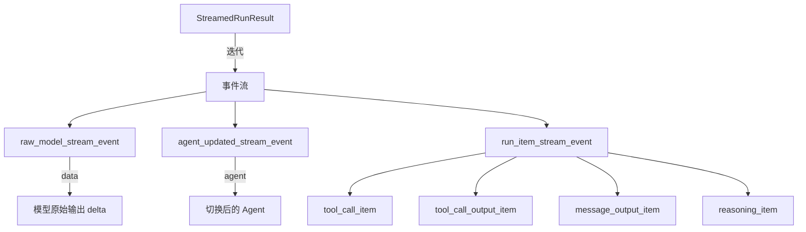

# 05 - 流式处理

> 来源：`examples/basic/stream-text.ts`, `basic/stream-items.ts`, `agent-patterns/streamed.ts`, `agent-patterns/agents-as-tools-streaming.ts`

## 概述

流式处理让 Agent 的输出逐步返回，而非等待完整响应。这对于实现打字机效果、进度展示和实时交互至关重要。

## 启用流式输出

只需在 `run()` 调用中添加 `stream: true`：

```typescript
import { Agent, run } from '@openai/agents';

const agent = new Agent({
  name: 'Storyteller',
  instructions: 'You tell engaging stories.'
});

const stream = await run(agent, 'Please tell me 5 jokes.', {
  stream: true
});
```

## 纯文本流：`toTextStream()`

最简单的流式处理方式，只获取文本输出：

```typescript
const stream = await run(agent, 'Tell me a story.', { stream: true });

for await (const event of stream.toTextStream()) {
  process.stdout.write(event);
}
```

### Node.js Streams 兼容

可以直接 pipe 到 Node.js 标准输出或其他 Writable Stream：

```typescript
const stream = await run(agent, 'Tell me a story.', { stream: true });

stream.toTextStream({ compatibleWithNodeStreams: true }).pipe(process.stdout);

await stream.completed;
```

关键点：

- `compatibleWithNodeStreams: true` 使文本流兼容 Node.js Stream API
- `await stream.completed` 等待流完成

## 完整事件流：`toStream()`

获取所有事件的详细信息，包括工具调用、Agent 切换等：

```typescript
const stream = await run(agent, 'Hello', { stream: true });

for await (const event of stream.toStream()) {
  switch (event.type) {
    case 'raw_model_stream_event':
      // 原始模型流事件（最底层）
      // event.data 包含模型的原始输出
      break;

    case 'agent_updated_stream_event':
      // Agent 切换事件
      console.log(`Agent updated: ${event.agent.name}`);
      break;

    case 'run_item_stream_event':
      // SDK 运行项事件
      if (event.item.type === 'tool_call_item') {
        console.log('Tool was called');
      } else if (event.item.type === 'tool_call_output_item') {
        console.log(`Tool output: ${event.item.output}`);
      } else if (event.item.type === 'message_output_item') {
        console.log(`Message: ${event.item.content}`);
      }
      break;
  }
}
```

### 直接迭代流

也可以直接使用 `for await` 迭代流对象：

```typescript
const stream = await run(agent, 'Hello', { stream: true });

for await (const event of stream) {
  if (event.type === 'raw_model_stream_event') {
    console.log('Raw event:', event.data);
  }
  if (event.type === 'agent_updated_stream_event') {
    console.log('New agent:', event.agent.name);
  }
  if (event.type === 'run_item_stream_event') {
    console.log('Run item:', event.item);
  }
}
```

## 事件类型详解



| 事件类型                     | 说明                           | 常用场景                  |
| ---------------------------- | ------------------------------ | ------------------------- |
| `raw_model_stream_event`     | 模型原始输出（最底层）         | 获取 token 级别的增量输出 |
| `agent_updated_stream_event` | Agent 发生切换                 | 追踪 handoff              |
| `run_item_stream_event`      | SDK 运行项（工具调用、输出等） | 追踪工具使用和最终输出    |

### run_item_stream_event 的子类型

| item.type               | 说明           |
| ----------------------- | -------------- |
| `tool_call_item`        | 工具被调用     |
| `tool_call_output_item` | 工具返回结果   |
| `message_output_item`   | Agent 输出消息 |
| `reasoning_item`        | 推理/思考内容  |

## 流式 Agent-as-Tool

子 Agent 作为工具执行时也支持流式事件回传：

```typescript
const subAgent = new Agent({
  name: 'Billing Agent',
  tools: [billingStatusChecker]
});

const billingTool = subAgent.asTool({
  toolName: 'billing_agent',
  toolDescription: 'Handle billing queries.',
  onStream: (event) => {
    // 接收子 Agent 的流式事件
    console.log(`Streaming from ${event.agent.name}:`, event);
  }
});

const mainAgent = new Agent({
  name: 'Main Agent',
  tools: [billingTool]
});

const stream = await run(mainAgent, 'Check my billing status', { stream: true });
```

## 流式结果属性

`StreamedRunResult` 除了事件流外，还提供：

| 属性/方法        | 说明                      |
| ---------------- | ------------------------- |
| `toTextStream()` | 获取纯文本流              |
| `toStream()`     | 获取完整事件流            |
| `completed`      | Promise，流完成时 resolve |
| `finalOutput`    | 最终输出（流完成后可用）  |
| `lastAgent`      | 最后活跃的 Agent          |
| `currentAgent`   | 当前活跃的 Agent          |
| `interruptions`  | 中断列表（HITL 场景）     |
| `state`          | 运行状态（可用于恢复）    |
| `lastResponseId` | 最后一次响应 ID           |
| `history`        | 完整历史记录              |

## 使用 Runner 实例的流式处理

```typescript
import { Runner } from '@openai/agents';

const runner = new Runner({
  model: 'gpt-4.1-mini'
});

const stream = await runner.run(agent, 'Tell me a story', { stream: true });

stream.toTextStream({ compatibleWithNodeStreams: true }).pipe(process.stdout);

await stream.completed;
```

## 最佳实践

1. **简单场景用 `toTextStream()`** — 只需要文本输出时
2. **需要追踪细节用 `toStream()`** — 工具调用、Agent 切换等
3. **总是 `await stream.completed`** — 确保流完成后再访问结果属性
4. **跳过 `raw_model_stream_event`** — 如果不需要 token 级别的细节
5. **流式 HITL 用 `stream.interruptions`** — 详见 [11-hitl.md](./11-hitl.md)

## 下一步

- Handoff 与路由（流式场景） → [06-handoff-and-routing.md](./06-handoff-and-routing.md)
- 流式护栏 → [12-guardrails.md](./12-guardrails.md)
- 流式 HITL → [11-hitl.md](./11-hitl.md)
