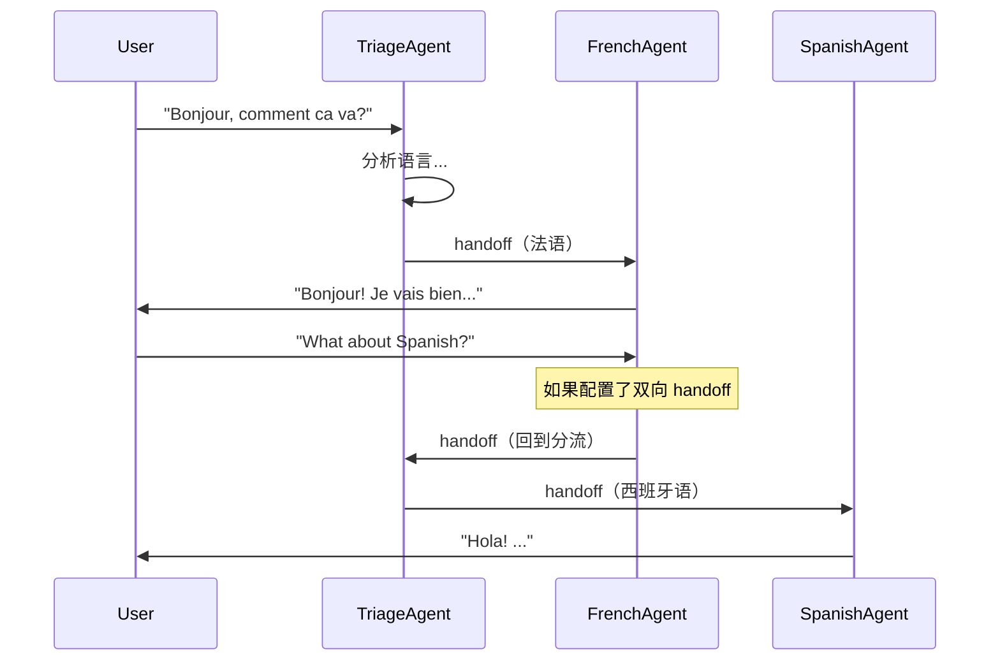

# 06 - Handoff 与路由

> 来源：`examples/basic/index.ts`, `basic/chat.ts`, `agent-patterns/routing.ts`

## 概述

Handoff（移交）是 SDK 的核心协作机制，允许一个 Agent 将对话转交给另一个 Agent。这是实现多 Agent 协作的基础。

## 基础 Handoff

### 定义可移交的 Agent

```typescript
import { Agent, Runner, tool } from '@openai/agents';
import { z } from 'zod';

const getWeather = tool({
  name: 'get_weather',
  description: 'Get the weather for a given city.',
  parameters: z.object({ city: z.string() }),
  execute: async ({ city }) => `The weather in ${city} is sunny.`
});

// 专门处理天气查询的 Agent
const weatherAgent = new Agent({
  name: 'Weather Agent',
  instructions: 'You are a weather specialist.',
  handoffDescription: 'You know everything about the weather.', // 被选中时的描述
  tools: [getWeather]
});

// 主 Agent，可以将对话移交给 weatherAgent
const mainAgent = new Agent({
  name: 'Main Agent',
  instructions: 'You are a helpful assistant. Hand off to the weather agent for weather queries.',
  handoffs: [weatherAgent]
});
```

### 运行并追踪 Handoff

```typescript
const runner = new Runner({
  groupId: 'My group',
  traceMetadata: { user_id: '123' }
});

const result = await runner.run(mainAgent, 'What is the weather in San Francisco?');
console.log(result.finalOutput);
// result.lastAgent 可能是 weatherAgent（如果发生了 handoff）
```

## 关键概念

### handoffDescription

`handoffDescription` 告诉发起 handoff 的 Agent **何时应该移交**：

```typescript
const codeAgent = new Agent({
  name: 'Code Agent',
  handoffDescription: 'Specialist for writing and reviewing code.',
  instructions: 'You write and review code.'
});

const researchAgent = new Agent({
  name: 'Research Agent',
  handoffDescription: 'Specialist for researching topics and gathering information.',
  instructions: 'You research topics thoroughly.'
});

const triageAgent = new Agent({
  name: 'Triage Agent',
  instructions: 'Route the user to the most appropriate specialist.',
  handoffs: [codeAgent, researchAgent]
});
```

### 追踪 Agent 切换

```typescript
const result = await run(triageAgent, 'Help me write a Python script');

// lastAgent: 最后执行的 Agent
console.log(`Final agent: ${result.lastAgent.name}`);
// 可能输出: "Final agent: Code Agent"
```

## 双向 Handoff

两个 Agent 可以互相移交，实现来回对话：

```typescript
const agentA = new Agent({
  name: 'Agent A',
  instructions: 'You handle general queries. Hand off to Agent B for technical questions.',
  handoffs: [] // 稍后设置
});

const agentB = new Agent({
  name: 'Agent B',
  instructions: 'You handle technical queries. Hand off to Agent A for general questions.',
  handoffs: [agentA]
});

// 设置双向引用
agentA.handoffs = [agentB];
```

## Triage Agent 路由模式

最常见的多 Agent 模式 — 一个分流 Agent 根据输入路由到合适的专家：

```typescript
import { Agent, run } from '@openai/agents';
import type { AgentInputItem, StreamedRunResult } from '@openai/agents';

const frenchAgent = new Agent({
  name: 'French Agent',
  instructions: 'You only speak French.'
});

const spanishAgent = new Agent({
  name: 'Spanish Agent',
  instructions: 'You only speak Spanish.'
});

const englishAgent = new Agent({
  name: 'English Agent',
  instructions: 'You only speak English.'
});

const triageAgent = new Agent({
  name: 'Triage Agent',
  instructions: 'Handoff to the appropriate agent based on the language of the user.',
  handoffs: [frenchAgent, spanishAgent, englishAgent]
});
```

### 路由 + 多轮对话

```typescript
let agent: Agent = triageAgent;
let inputs: AgentInputItem[] = [{ role: 'user', content: userMessage }];

while (true) {
  // 流式执行
  const result: StreamedRunResult = await run(agent, inputs, { stream: true });
  result.toTextStream({ compatibleWithNodeStreams: true }).pipe(process.stdout);
  await result.completed;

  // 更新状态
  inputs = result.history;
  agent = result.currentAgent ?? agent; // 可能已路由到新 Agent

  // 获取下一条用户输入
  const nextMessage = await getUserInput();
  inputs.push({ role: 'user', content: nextMessage });
}
```

关键点：

- `result.currentAgent` — 获取当前活跃的 Agent（可能因路由而改变）
- 使用更新后的 `agent` 继续下一轮对话
- `result.history` 保持完整上下文

## Handoff 流程图



## 多轮对话中的 Agent 切换

```typescript
import { Agent, run, user } from '@openai/agents';
import type { AgentInputItem } from '@openai/agents';

let history: AgentInputItem[] = [];
let latestAgent: Agent = mainAgent;

while (true) {
  const message = await getUserInput();
  if (message === 'exit()') break;

  history.push(user(message));
  const result = await run(latestAgent, history);

  console.log(`[${latestAgent.name}] ${result.finalOutput}`);

  // 更新活跃 Agent
  if (result.lastAgent) {
    latestAgent = result.lastAgent;
  }
  history = result.history;
}
```

## 最佳实践

1. **为每个 Agent 设置 `handoffDescription`** — 帮助发起者理解何时移交
2. **Triage Agent 指令要明确** — 说清楚何种情况路由到哪个 Agent
3. **追踪 `lastAgent` / `currentAgent`** — 在多轮对话中保持正确的 Agent
4. **避免过长的 handoff 链** — 过深的链路可能导致上下文丢失
5. **流式模式用 `currentAgent`** — 实时追踪 Agent 切换

## 下一步

- 多模态处理 → [07-multimodal.md](./07-multimodal.md)
- Agent 设计模式 → [13-agent-patterns.md](./13-agent-patterns.md)
- Agents as Tools 模式 → [13-agent-patterns.md](./13-agent-patterns.md)
