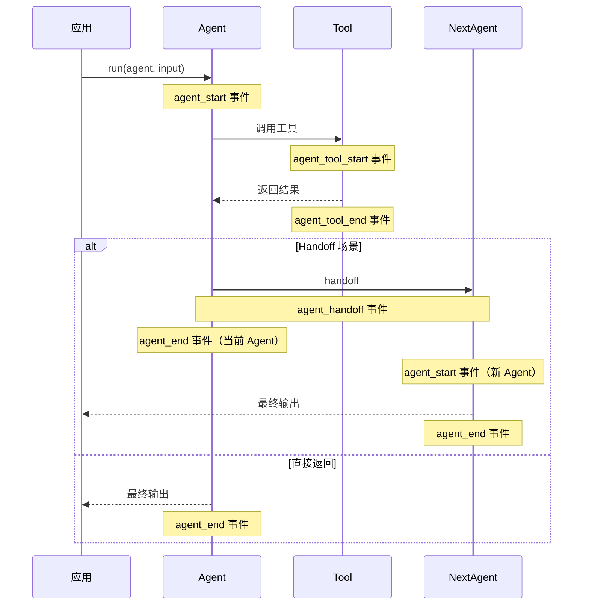

# 08 - 生命周期钩子

> 来源：`examples/basic/lifecycle-example.ts`, `basic/agent-lifecycle-example.ts`

## 概述

生命周期钩子允许你监听 Agent 执行过程中的关键事件，用于日志记录、使用量统计、性能监控和调试。

## 事件类型

SDK 提供以下生命周期事件：

| 事件               | 触发时机           | 回调参数                            |
| ------------------ | ------------------ | ----------------------------------- |
| `agent_start`      | Agent 开始执行     | `(ctx, agent)`                      |
| `agent_end`        | Agent 执行完成     | `(ctx, output)`                     |
| `agent_tool_start` | 工具开始调用       | `(ctx, tool, { toolCall })`         |
| `agent_tool_end`   | 工具调用完成       | `(ctx, tool, result, { toolCall })` |
| `agent_handoff`    | Agent 发起 handoff | `(ctx, nextAgent)`                  |

## 基础用法

### 简单事件监听

```typescript
import { Agent } from '@openai/agents'

const agent = new Agent({
  name: 'My Agent',
  instructions: 'You are helpful.',
  tools: [getWeather],
  handoffs: [specialistAgent]
})

agent.on('agent_start', (_ctx, agent) => {
  console.log(`${agent.name} started`)
})

agent.on('agent_end', (_ctx, output) => {
  console.log(`${agent.name} ended with output: ${output}`)
})

agent.on('agent_handoff', (_ctx, nextAgent) => {
  console.log(`${agent.name} handed off to ${nextAgent.name}`)
})

agent.on('agent_tool_start', (_ctx, tool) => {
  console.log(`${agent.name} started tool ${tool.name}`)
})

agent.on('agent_tool_end', (_ctx, tool, output) => {
  console.log(`${agent.name} tool ${tool.name} ended with output: ${output}`)
})
```

## 高级用法：使用量统计

`ctx` 参数包含 `usage` 对象，可以追踪 Token 消耗：

```typescript
import { Agent } from '@openai/agents'
import type { Usage } from '@openai/agents'

function toPrintableUsage(usage: Usage): string {
  return (
    `${usage.requests ?? 0} requests, ` +
    `${usage.inputTokens ?? 0} input tokens, ` +
    `${usage.outputTokens ?? 0} output tokens, ` +
    `${usage.totalTokens ?? 0} total tokens`
  )
}

function attachHooks(agent: Agent<any, any>) {
  let eventCounter = 0

  agent.on('agent_start', (ctx, agent) => {
    eventCounter++
    console.log(`### ${eventCounter}: ${agent.name} started`)
    console.log(`   Usage: ${toPrintableUsage(ctx?.usage)}`)
  })

  agent.on('agent_end', (ctx, output) => {
    eventCounter++
    console.log(`### ${eventCounter}: ${agent.name} ended`)
    console.log(`   Output: ${JSON.stringify(output)}`)
    console.log(`   Usage: ${toPrintableUsage(ctx?.usage)}`)
  })

  agent.on('agent_tool_start', (ctx, tool, { toolCall }) => {
    eventCounter++
    console.log(`### ${eventCounter}: Tool ${tool.name} started`)
    console.log(`   Args: ${toolCall.arguments}`)
    console.log(`   Usage: ${toPrintableUsage(ctx?.usage)}`)
  })

  agent.on('agent_tool_end', (ctx, tool, result, { toolCall }) => {
    eventCounter++
    console.log(`### ${eventCounter}: Tool ${tool.name} ended`)
    console.log(`   Result: ${JSON.stringify(result)}`)
    console.log(`   Usage: ${toPrintableUsage(ctx?.usage)}`)
  })

  agent.on('agent_handoff', (ctx, nextAgent) => {
    eventCounter++
    console.log(`### ${eventCounter}: Handoff to ${nextAgent.name}`)
    console.log(`   Usage: ${toPrintableUsage(ctx?.usage)}`)
  })
}

// 为多个 Agent 添加钩子
attachHooks(mainAgent)
attachHooks(weatherAgent)
```

## Usage 对象

```typescript
interface Usage {
  requests?: number // API 请求次数
  inputTokens?: number // 输入 Token 数
  outputTokens?: number // 输出 Token 数
  totalTokens?: number // 总 Token 数
}
```

`usage` 是**累计值**，从运行开始到当前事件的总消耗。

## 执行流程可视化



## 实际应用场景

### 日志记录

```typescript
agent.on('agent_start', (_ctx, agent) => {
  logger.info(`[Agent] ${agent.name} started`)
})

agent.on('agent_end', (ctx, output) => {
  logger.info(`[Agent] ${agent.name} ended`, {
    tokens: ctx?.usage?.totalTokens,
    output: typeof output === 'string' ? output.substring(0, 100) : output
  })
})
```

### 成本追踪

```typescript
let totalTokens = 0

agent.on('agent_end', (ctx) => {
  totalTokens = ctx?.usage?.totalTokens ?? 0
})

// 运行完成后
const result = await run(agent, input)
console.log(`Total tokens used: ${totalTokens}`)
```

### 工具调用审计

```typescript
const toolCalls: Array<{ tool: string; args: string; result: unknown }> = []

agent.on('agent_tool_start', (_ctx, tool, { toolCall }) => {
  toolCalls.push({ tool: tool.name, args: toolCall.arguments, result: null })
})

agent.on('agent_tool_end', (_ctx, tool, result) => {
  const entry = toolCalls.find((c) => c.tool === tool.name && c.result === null)
  if (entry) entry.result = result
})
```

## 最佳实践

1. **生产环境用 `agent_end`** — 追踪总 Token 消耗和成本
2. **调试用 `agent_tool_start/end`** — 追踪工具调用细节
3. **多 Agent 场景为所有 Agent 添加钩子** — 避免遗漏
4. **钩子函数要轻量** — 避免影响 Agent 执行性能
5. **使用 eventCounter 追踪事件顺序** — 便于调试复杂流程

## 下一步

- 上下文与动态指令 → [09-context-and-dynamic-prompt.md](./09-context-and-dynamic-prompt.md)
- 高级特性（追踪） → [14-advanced-features.md](./14-advanced-features.md)
