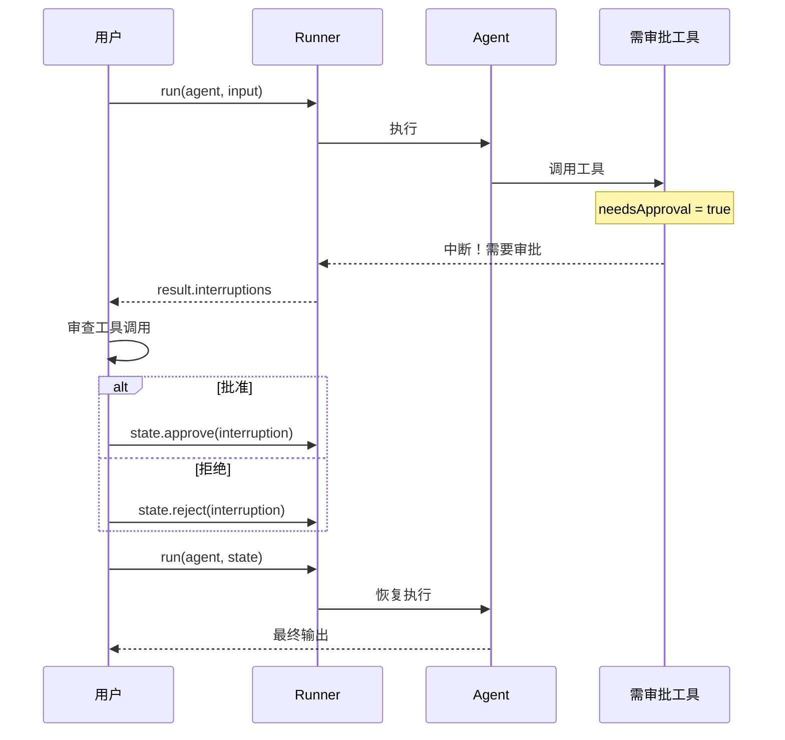
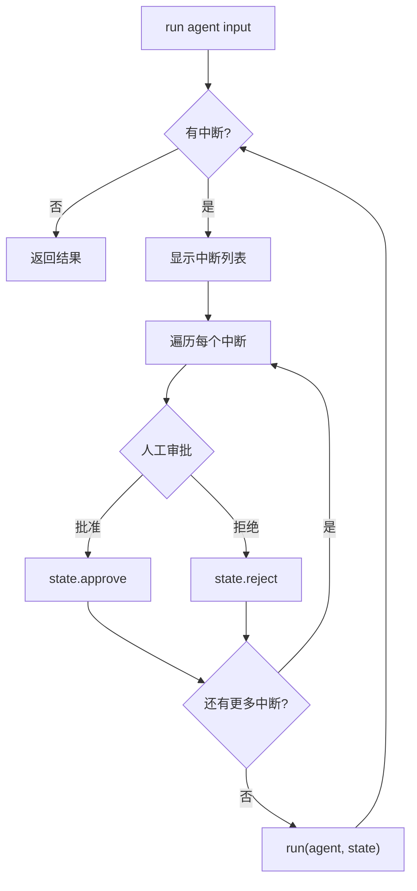

# 11 - Human-in-the-Loop

> 来源：`examples/agent-patterns/human-in-the-loop.ts`, `agent-patterns/human-in-the-loop-stream.ts`, `memory/memory-hitl.ts`, `memory/file-hitl.ts`, `memory/oai-hitl.ts`, `memory/hitl-session-scenario.ts`

## 概述

Human-in-the-Loop（HITL）机制允许在 Agent 调用敏感工具时暂停执行，等待人工审批后再继续。这对于涉及支付、数据修改、外部操作等需要人工确认的场景至关重要。

## 核心概念



## 基础用法

### 1. 定义需要审批的工具

```typescript
import { Agent, run, tool } from '@openai/agents';
import { z } from 'zod';

const getTemperature = tool({
  name: 'get_temperature',
  description: 'Get the temperature for a city.',
  parameters: z.object({ city: z.string() }),
  // needsApproval 可以是布尔值或函数
  needsApproval: async (_ctx, { city }) => {
    // 只有查询 Oakland 时需要审批
    return city.includes('Oakland');
  },
  execute: async ({ city }) => {
    return `The temperature in ${city} is 72F.`;
  }
});
```

### 2. 处理中断

```typescript
const agent = new Agent({
  name: 'Weather Agent',
  instructions: 'You check the temperature.',
  tools: [getTemperature]
});

let result = await run(agent, 'What is the temperature in Oakland?');

// 检查是否有中断
while (result.interruptions?.length > 0) {
  for (const interruption of result.interruptions) {
    console.log(`Agent ${interruption.agent.name} wants to use tool: ${interruption.toolName}`);
    console.log(`Arguments: ${JSON.stringify(interruption.args)}`);

    const approved = await promptUser('Approve? (y/n)');

    if (approved) {
      result.state.approve(interruption);
    } else {
      result.state.reject(interruption);
    }
  }

  // 恢复执行
  result = await run(agent, result.state);
}

console.log(result.finalOutput);
```

### 3. 关键 API

| API                                  | 说明                                 |
| ------------------------------------ | ------------------------------------ |
| `tool.needsApproval`                 | 设置工具需要审批（布尔值或异步函数） |
| `result.interruptions`               | 中断列表                             |
| `result.state`                       | 运行状态对象                         |
| `result.state.approve(interruption)` | 批准工具调用                         |
| `result.state.reject(interruption)`  | 拒绝工具调用                         |
| `run(agent, state)`                  | 使用状态恢复执行                     |

## Agent-as-Tool 的 HITL

Agent 作为工具使用时也可以设置审批：

```typescript
const weatherAgent = new Agent({
  name: 'Weather Agent',
  tools: [getWeather]
});

const mainAgent = new Agent({
  name: 'Main Agent',
  tools: [
    weatherAgent.asTool({
      toolName: 'ask_weather_agent',
      // 针对 Agent-as-Tool 的审批
      needsApproval: async (_ctx, { input }) => {
        return input.includes('San Francisco');
      }
    })
  ]
});
```

## 状态序列化与反序列化

状态可以序列化为 JSON，跨进程/线程传输：

```typescript
import { RunState } from '@openai/agents';
import fs from 'fs';

// 保存状态
const result = await run(agent, userMessage);
if (result.interruptions?.length > 0) {
  await fs.promises.writeFile('result.json', JSON.stringify(result.state, null, 2));
}

// --- 可能在不同进程/线程中 ---

// 恢复状态
const storedState = await fs.promises.readFile('result.json', 'utf-8');
const state = await RunState.fromString(agent, storedState);

// 批准并继续
for (const interruption of state.interruptions) {
  state.approve(interruption);
}
const finalResult = await run(agent, state);
```

这对于以下场景非常有用：

- Web 应用中的异步审批流程
- 长时间运行的审批（如需要经理审批）
- 跨服务的审批处理

## 流式 HITL

流式模式下的 HITL 处理方式略有不同：

```typescript
let stream = await run(mainAgent, userMessage, { stream: true });

// 输出文本流
stream.toTextStream({ compatibleWithNodeStreams: true }).pipe(process.stdout);
await stream.completed;

// 检查中断
while (stream.interruptions?.length) {
  const state = stream.state;

  for (const interruption of stream.interruptions) {
    const ok = await promptUser(`Approve ${interruption.toolName}?`);
    if (ok) {
      state.approve(interruption);
    } else {
      state.reject(interruption);
    }
  }

  // 恢复流式执行
  stream = await run(mainAgent, state, { stream: true });
  stream.toTextStream({ compatibleWithNodeStreams: true }).pipe(process.stdout);
  await stream.completed;
}

console.log('\nFinal output:', stream.finalOutput);
```

## HITL + Session

HITL 与 Session 可以结合使用，实现持久化审批流程：

### MemorySession + HITL

```typescript
import { MemorySession } from '@openai/agents';

const session = new MemorySession();

async function resolveInterruptions(agent, result, session) {
  while (result.interruptions?.length) {
    for (const interruption of result.interruptions) {
      const approved = await promptUser(`Approve?`);
      if (approved) {
        result.state.approve(interruption);
      } else {
        result.state.reject(interruption);
      }
    }
    // 使用 session 恢复执行
    result = await run(agent, result.state, { session });
  }
  return result;
}

let result = await run(agent, userMessage, { session });
result = await resolveInterruptions(agent, result, session);
```

### FileSession + HITL

```typescript
import { FileSession } from './sessions';

const session = new FileSession({ dir: './tmp' });
const sessionId = await session.getSessionId();

let result = await run(agent, userMessage, { session });
// ... 处理中断 ...

// 恢复会话（不同进程）
const restoredSession = new FileSession({ dir: './tmp', sessionId });
// 继续之前的对话
```

### OpenAIConversationsSession + HITL

```typescript
import { OpenAIConversationsSession } from '@openai/agents';

const session = new OpenAIConversationsSession();
let result = await run(agent, userMessage, { session });
// ... 处理中断，逻辑相同 ...
```

## needsApproval 函数签名

```typescript
type NeedsApproval = boolean | ((ctx: RunContext, args: Record<string, unknown>) => boolean | Promise<boolean>);
```

- `boolean` — 始终需要或不需要审批
- `Function` — 动态判断，接收上下文和工具参数

## 中断对象（Interruption）

```typescript
interface Interruption {
  agent: Agent; // 发起调用的 Agent
  toolName: string; // 工具名称
  args: unknown; // 工具参数
  toolCall: ToolCall; // 原始工具调用
}
```

## 完整处理流程



## 最佳实践

1. **只对关键工具设置审批** — 不要所有工具都要审批
2. **`needsApproval` 用函数** — 根据参数动态判断是否需要审批
3. **状态要持久化** — 长时间审批场景使用 `RunState.fromString()`
4. **结合 Session** — 确保审批前后的对话历史一致
5. **流式 + HITL** — 用户可以在等待审批时看到部分输出

## 下一步

- 护栏系统 → [12-guardrails.md](./12-guardrails.md)
- 记忆与会话管理 → [10-memory-session.md](./10-memory-session.md)
- 工具系统 → [03-tools.md](./03-tools.md)
