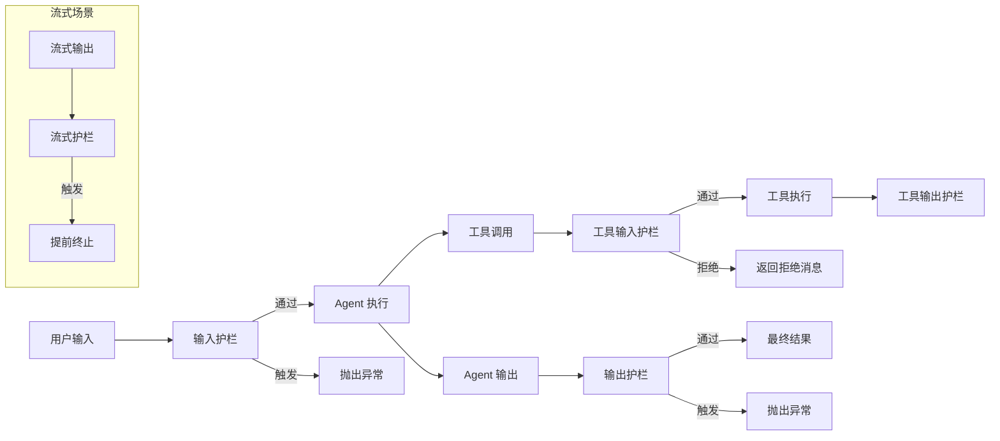

# 12 - 护栏系统

> 来源：`examples/agent-patterns/input-guardrails.ts`, `agent-patterns/output-guardrails.ts`, `agent-patterns/streaming-guardrails.ts`, `basic/tools.ts`

## 概述

护栏（Guardrails）是 Agent 的安全防护机制，在 Agent 执行前后检查内容的合规性。SDK 提供三个层级的护栏：Agent 输入护栏、Agent 输出护栏、工具级护栏，以及流式护栏。

## 护栏体系总览



## 输入护栏（Input Guardrails）

在 Agent 执行前检查用户输入，阻止不合适的请求：

```typescript
import { Agent, run, withTrace } from '@openai/agents'
import { z } from 'zod'

// 专门用于判断输入的护栏 Agent
const guardrailAgent = new Agent({
  name: 'Guardrail Agent',
  instructions: 'Check if the user is asking you to do their math homework.',
  outputType: z.object({
    isMathHomework: z.boolean()
  })
})

// 主 Agent，配置输入护栏
const agent = new Agent({
  name: 'Customer Support Agent',
  instructions: 'You are a customer support agent. Help the user with their questions.',
  inputGuardrails: [
    {
      name: 'Math Homework Guardrail',
      execute: async ({ input, context }) => {
        // 使用护栏 Agent 评估输入
        const result = await run(guardrailAgent, input, { context })
        return {
          tripwireTriggered: result.finalOutput?.isMathHomework ?? false,
          outputInfo: result.finalOutput
        }
      }
    }
  ]
})
```

### 处理护栏触发

护栏触发时会抛出异常：

```typescript
try {
  const result = await run(agent, 'Can you solve 2x + 5 = 15?')
  console.log(result.finalOutput)
} catch (e: unknown) {
  // 输入护栏被触发
  console.log("Sorry, I can't help you with your math homework.")
}
```

### 护栏返回值

```typescript
interface GuardrailResult {
  tripwireTriggered: boolean // 是否触发护栏
  outputInfo?: unknown // 额外信息（用于日志或调试）
}
```

## 输出护栏（Output Guardrails）

在 Agent 输出后检查内容，阻止不安全的响应：

### 文本输出护栏

```typescript
const agent = new Agent({
  name: 'Assistant',
  instructions: 'You are a helpful assistant.',
  outputGuardrails: [
    {
      name: 'Phone Number Guardrail',
      execute: async ({ agentOutput }) => {
        // 检查输出中是否包含电话号码
        const hasPhoneNumber = agentOutput.includes('650')
        return {
          tripwireTriggered: hasPhoneNumber,
          outputInfo: 'Phone number found in output'
        }
      }
    }
  ]
})
```

### 结构化输出护栏

当 Agent 配置了 `outputType` 时，护栏可以检查结构化数据：

```typescript
const messageOutput = z.object({
  reasoning: z.string(),
  response: z.string(),
  userName: z.string().nullable()
})

const agent = new Agent({
  name: 'Assistant',
  outputType: messageOutput,
  outputGuardrails: [
    {
      name: 'Phone Number Guardrail',
      execute: async ({ agentOutput }) => {
        // agentOutput 是结构化对象
        const phoneInResponse = agentOutput.response.includes('650')
        const phoneInReasoning = agentOutput.reasoning.includes('650')
        return {
          tripwireTriggered: phoneInResponse || phoneInReasoning,
          outputInfo: {
            phone_number_in_response: phoneInResponse,
            phone_number_in_reasoning: phoneInReasoning
          }
        }
      }
    }
  ]
})
```

## 工具级护栏

工具可以独立配置输入和输出护栏：

```typescript
import { tool } from '@openai/agents'
import { z } from 'zod'

const getWeather = tool({
  name: 'get_weather',
  description: 'Get the weather for a city.',
  parameters: z.object({ city: z.string() }),
  execute: async ({ city }) => ({ city, conditions: 'Sunny' }),

  // 工具输入护栏
  inputGuardrails: [
    {
      name: 'city_validation',
      run: async ({ toolCall }) => {
        const args = JSON.parse(toolCall.arguments)
        if (args.city.toLowerCase() !== 'tokyo') {
          return {
            behavior: {
              type: 'rejectContent',
              message: 'I can only check weather for cities in Japan.'
            }
          }
        }
        return { behavior: { type: 'allow' } }
      }
    }
  ],

  // 工具输出护栏
  outputGuardrails: [
    {
      name: 'output_check',
      run: async ({ output }) => {
        return { behavior: { type: 'allow' } }
      }
    }
  ]
})
```

### 工具护栏行为

| 行为                                         | 说明                 |
| -------------------------------------------- | -------------------- |
| `{ type: 'allow' }`                          | 允许继续执行         |
| `{ type: 'rejectContent', message: string }` | 拒绝，返回消息给 LLM |

工具护栏与 Agent 护栏的区别：

- **Agent 护栏**：触发时**抛出异常**，终止整个运行
- **工具护栏**：触发时**返回拒绝消息**给 LLM，LLM 可以调整行为

## 流式护栏

在流式输出过程中实时检查内容，必要时提前终止：

```typescript
import { Agent, run } from '@openai/agents'
import { z } from 'zod'

// 护栏检查 Agent
const GuardrailOutput = z.object({
  reasoning: z.string(),
  isReadableByTenYearOld: z.boolean()
})

const guardrailAgent = new Agent({
  name: 'Readability Checker',
  instructions: 'Judge whether the response is simple enough for a 10-year-old.',
  outputType: GuardrailOutput
})

async function runGuardrail(text: string) {
  const result = await run(guardrailAgent, text)
  return result.finalOutput
}

// 流式输出 + 定期检查
const agent = new Agent({
  name: 'Science Agent',
  instructions: 'Explain scientific concepts.'
})

let currentText = ''
let nextCheckAt = 300 // 每 300 字符检查一次

const result = await run(agent, 'What is a black hole?', { stream: true })

for await (const event of result) {
  if (event.type === 'raw_model_stream_event' && event.data.type === 'output_text_delta') {
    // 输出文本
    process.stdout.write(event.data.delta)
    currentText += event.data.delta

    // 达到阈值时检查
    if (currentText.length > nextCheckAt) {
      const check = await runGuardrail(currentText)

      if (check && !check.isReadableByTenYearOld) {
        console.log(`\n\nGuardrail tripped! Reason: ${check.reasoning}`)
        return // 提前终止流式输出
      }

      nextCheckAt += 300 // 下次检查点
    }
  }
}
```

### 流式护栏策略

| 策略       | 说明                 | 适用场景       |
| ---------- | -------------------- | -------------- |
| 定长检查   | 每 N 字符检查一次    | 通用内容审核   |
| 关键词检测 | 匹配到关键词立即检查 | 敏感词过滤     |
| 累计检查   | 对全部已输出内容检查 | 上下文相关审核 |

## 护栏组合使用

```typescript
const agent = new Agent({
  name: 'Secure Agent',
  instructions: 'You are a helpful assistant.',

  // 输入护栏：拒绝不合适的请求
  inputGuardrails: [
    {
      name: 'topic_check',
      execute: async ({ input }) => ({
        tripwireTriggered: isForbiddenTopic(input)
      })
    }
  ],

  // 输出护栏：过滤敏感信息
  outputGuardrails: [
    {
      name: 'pii_check',
      execute: async ({ agentOutput }) => ({
        tripwireTriggered: containsPII(agentOutput)
      })
    }
  ],

  // 工具带有自己的护栏
  tools: [getWeatherWithGuardrails]
})
```

## 三层护栏对比

| 层级     | 触发时机      | 触发行为     | 配置位置                                  |
| -------- | ------------- | ------------ | ----------------------------------------- |
| 输入护栏 | Agent 执行前  | 抛出异常     | `agent.inputGuardrails`                   |
| 工具护栏 | 工具调用前/后 | 返回拒绝消息 | `tool.inputGuardrails / outputGuardrails` |
| 输出护栏 | Agent 输出后  | 抛出异常     | `agent.outputGuardrails`                  |
| 流式护栏 | 流式输出中    | 提前终止     | 自定义逻辑                                |

## 最佳实践

1. **输入护栏用 Agent** — 让 LLM 做语义判断比规则更灵活
2. **输出护栏检查 PII** — 防止泄露个人信息
3. **工具护栏验证参数** — 确保工具调用参数合法
4. **流式护栏设置合理间隔** — 太频繁影响性能，太稀疏漏检
5. **多层护栏组合** — 不同层级互补，构建纵深防御

## 下一步

- Agent 设计模式 → [13-agent-patterns.md](./13-agent-patterns.md)
- Human-in-the-Loop → [11-hitl.md](./11-hitl.md)
- 工具系统 → [03-tools.md](./03-tools.md)
