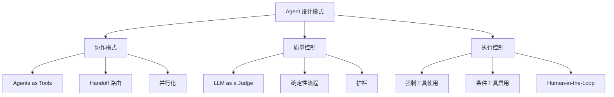
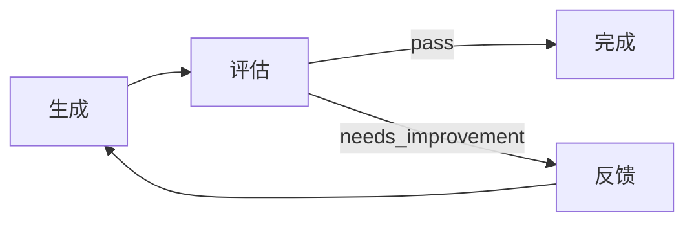

# 13 - Agent 设计模式

> 来源：`examples/agent-patterns/` 全部文件

## 概述

本文总结了 SDK 支持的常用 Agent 设计模式，覆盖协作、质量控制、并行执行等场景。每种模式都有明确的适用场景和实现方式。

## 模式总览



## 模式 1：Agents as Tools

将 Agent 封装为工具，供主 Agent 调用。与 Handoff 不同，控制权不会转移，子 Agent 执行完后结果返回给主 Agent。

### 基础用法

```typescript
import { Agent, run, withTrace } from '@openai/agents';

const spanishAgent = new Agent({
  name: 'Spanish Translator',
  instructions: "You translate the user's message to Spanish."
});

const frenchAgent = new Agent({
  name: 'French Translator',
  instructions: "You translate the user's message to French."
});

const orchestrator = new Agent({
  name: 'Orchestrator',
  instructions: 'You are a translation orchestrator. Use the available tools to translate.',
  tools: [
    spanishAgent.asTool({
      toolName: 'translate_to_spanish',
      toolDescription: "Translate the user's message to Spanish.",
      runConfig: {
        model: 'gpt-5',
        modelSettings: {
          reasoning: { effort: 'low' },
          text: { verbosity: 'low' }
        }
      },
      runOptions: {
        maxTurns: 3
      }
    }),
    frenchAgent.asTool({
      toolName: 'translate_to_french',
      toolDescription: "Translate the user's message to French."
    })
  ]
});

const result = await run(orchestrator, 'Say "Hello, how are you?" in both languages');
```

### 结构化工具输入

使用 Zod Schema 定义工具参数，模型自动填充：

```typescript
import { z } from 'zod';

const translator = new Agent({
  name: 'Translator',
  instructions: 'You translate text between languages.'
});

const orchestrator = new Agent({
  tools: [
    translator.asTool({
      toolName: 'translate_text',
      toolDescription: 'Translate text between languages.',
      parameters: z.object({
        text: z.string().describe('Text to translate.'),
        source: z.string().describe('Source language code.'),
        target: z.string().describe('Target language code.')
      })
    })
  ],
  modelSettings: { toolChoice: 'required' }
});
```

### 流式 Agent-as-Tool

监听子 Agent 的流式事件：

```typescript
const billingTool = billingAgent.asTool({
  toolName: 'billing_agent',
  toolDescription: 'Handle billing queries.',
  onStream: (event) => {
    console.log(`Event from ${event.agent.name}:`, event);
  }
});
```

### Agents as Tools vs Handoff

| 特性     | Agents as Tools             | Handoff                 |
| -------- | --------------------------- | ----------------------- |
| 控制权   | 保持在主 Agent              | 转移给目标 Agent        |
| 结果处理 | 主 Agent 接收并处理         | 目标 Agent 直接输出     |
| 适用场景 | 编排、汇总                  | 专家路由                |
| 并行调用 | 主 Agent 可并行调用多个工具 | 一次只能 handoff 给一个 |

## 模式 2：条件工具启用

根据运行时上下文动态控制工具可见性：

```typescript
import { Agent, RunContext, run } from '@openai/agents';

type LanguagePreference = 'spanish_only' | 'french_spanish' | 'european';
type AppContext = { languagePreference: LanguagePreference };

const orchestrator = new Agent<AppContext>({
  tools: [
    spanishAgent.asTool({
      toolName: 'respond_spanish',
      isEnabled: true
    }),
    frenchAgent.asTool({
      toolName: 'respond_french',
      isEnabled: ({ runContext }: { runContext: RunContext<AppContext> }) => {
        const pref = runContext.context.languagePreference;
        return pref === 'french_spanish' || pref === 'european';
      }
    }),
    italianAgent.asTool({
      toolName: 'respond_italian',
      isEnabled: ({ runContext }: { runContext: RunContext<AppContext> }) => {
        return runContext.context.languagePreference === 'european';
      }
    })
  ]
});

// spanish_only: 只看到 spanish 工具
await run(orchestrator, 'Hello', {
  context: { languagePreference: 'spanish_only' }
});

// european: 看到全部三个工具
await run(orchestrator, 'Hello', {
  context: { languagePreference: 'european' }
});
```

## 模式 3：确定性流程

固定步骤顺序执行，使用结构化输出做门控判断：

```typescript
import { Agent, run, withTrace } from '@openai/agents';
import { z } from 'zod';

const outlineAgent = new Agent({
  name: 'Outline Generator',
  instructions: 'Generate a very short story outline.'
});

const checker = new Agent({
  name: 'Outline Checker',
  instructions: 'Judge the quality of the story outline.',
  outputType: z.object({
    good_quality: z.boolean(),
    is_scifi: z.boolean()
  })
});

const storyAgent = new Agent({
  name: 'Story Writer',
  instructions: 'Write a story based on the outline.'
});

await withTrace('Deterministic story flow', async () => {
  // Step 1: 生成大纲
  const outlineResult = await run(outlineAgent, 'Write a sci-fi story outline');

  // Step 2: 质量检查
  const checkResult = await run(checker, outlineResult.finalOutput);

  // Step 3: 门控判断
  if (!checkResult.finalOutput.good_quality) {
    console.log('Quality check failed. Stopping.');
    return;
  }
  if (!checkResult.finalOutput.is_scifi) {
    console.log('Not a sci-fi story. Stopping.');
    return;
  }

  // Step 4: 写完整故事
  const storyResult = await run(storyAgent, outlineResult.finalOutput);
  console.log(storyResult.finalOutput);
});
```

## 模式 4：LLM as a Judge

使用独立的评估 Agent 评判输出质量，迭代改进：

```typescript
import { Agent, run } from '@openai/agents';
import type { AgentInputItem } from '@openai/agents';
import { z } from 'zod';

const generator = new Agent({
  name: 'Story Outline Generator',
  instructions: 'Generate a story outline based on feedback if provided.'
});

const EvaluationFeedback = z.object({
  feedback: z.string(),
  score: z.enum(['pass', 'needs_improvement', 'fail'])
});

const evaluator = new Agent({
  name: 'Evaluator',
  instructions: 'Evaluate the story outline. Be critical but constructive.',
  outputType: EvaluationFeedback
});

let inputItems: AgentInputItem[] = [{ content: 'Write a sci-fi story outline', role: 'user' }];
let latestOutline = '';
let turns = 0;
const maxTurns = 5;

while (turns < maxTurns) {
  const genResult = await run(generator, inputItems);
  inputItems = genResult.history;
  latestOutline = genResult.finalOutput;

  const evalResult = await run(evaluator, inputItems);
  const evaluation = evalResult.finalOutput;

  console.log(`Turn ${turns + 1}: Score = ${evaluation?.score}`);

  if (evaluation?.score === 'pass') {
    console.log('Approved!');
    break;
  }

  inputItems.push({
    content: `Feedback: ${evaluation?.feedback}. Please improve the outline.`,
    role: 'user'
  });

  turns++;
}

console.log('Final outline:', latestOutline);
```

### LLM as a Judge 流程



## 模式 5：并行化

使用 `Promise.all` 并行执行多个 Agent，然后汇总结果：

```typescript
import { Agent, run, withTrace, extractAllTextOutput } from '@openai/agents';

const translator = new Agent({
  name: 'Spanish Translator',
  instructions: 'Translate to Spanish. Be creative and natural.'
});

const picker = new Agent({
  name: 'Translation Picker',
  instructions: 'Pick the best Spanish translation from the options.'
});

await withTrace('Parallel translation', async () => {
  const msg = 'Hello, how are you today?';

  const [res1, res2, res3] = await Promise.all([run(translator, msg), run(translator, msg), run(translator, msg)]);

  const outputs = [
    extractAllTextOutput(res1.newItems),
    extractAllTextOutput(res2.newItems),
    extractAllTextOutput(res3.newItems)
  ];

  const translations = outputs.join('\n\n---\n\n');

  const best = await run(picker, `Original: ${msg}\n\nTranslations:\n${translations}`);

  console.log('Best translation:', best.finalOutput);
});
```

### 并行化适用场景

| 场景          | 说明                            |
| ------------- | ------------------------------- |
| 多版本生成    | 生成多个版本，选最佳            |
| 多 Agent 协作 | 不同专家并行处理子任务          |
| 投票共识      | 多个 Agent 独立判断，取多数结果 |
| A/B 测试      | 对比不同提示或模型的效果        |

## 模式 6：强制工具使用

确保 Agent 必须调用工具，控制工具结果的处理方式：

```typescript
import { Agent, tool, run } from '@openai/agents';
import type { ToolToFinalOutputFunction, FunctionToolResult, RunContext } from '@openai/agents';

const customBehavior: ToolToFinalOutputFunction = async (_context: RunContext, results: FunctionToolResult[]) => {
  const output = results.find((r) => r.type === 'function_output');
  if (!output) {
    return { isFinalOutput: false, isInterrupted: undefined };
  }
  return {
    isFinalOutput: true,
    finalOutput: `Processed: ${JSON.stringify(output.output)}`
  };
};

const agent = new Agent({
  tools: [getWeather],
  modelSettings: { toolChoice: 'required' },
  toolUseBehavior: customBehavior
});
```

### 三种 toolUseBehavior

| 行为                         | 说明                              |
| ---------------------------- | --------------------------------- |
| `'run_llm_again'`            | 工具结果返回 LLM 继续处理（默认） |
| `{ stopAtToolNames: [...] }` | 调用指定工具后立即停止            |
| 自定义函数                   | 完全控制工具结果处理              |

## 模式选择指南

| 需求                 | 推荐模式          |
| -------------------- | ----------------- |
| 主 Agent 编排子任务  | Agents as Tools   |
| 根据输入选择专家     | Handoff 路由      |
| 多版本生成选最佳     | 并行化            |
| 固定流程加质量检查   | 确定性流程        |
| 迭代改进输出质量     | LLM as a Judge    |
| 根据用户权限控制功能 | 条件工具启用      |
| 安全防护             | 护栏              |
| 敏感操作审批         | Human-in-the-Loop |
| 工具结果直接使用     | 强制工具使用      |

## 模式组合

实际应用中通常组合多个模式：

```typescript
// Triage 路由 + 确定性流程 + 护栏
const triageAgent = new Agent({
  name: 'Triage',
  instructions: 'Route to the appropriate specialist.',
  handoffs: [codeAgent, researchAgent],
  inputGuardrails: [topicGuardrail]
});

// Agents as Tools + 并行化 + LLM 评估
const orchestrator = new Agent({
  tools: [writer.asTool({ toolName: 'write' }), reviewer.asTool({ toolName: 'review' })]
});

const [draft1, draft2] = await Promise.all([run(writer, prompt), run(writer, prompt)]);
const best = await run(evaluator, `Compare:\n${draft1.finalOutput}\n---\n${draft2.finalOutput}`);
```

## 最佳实践

1. **简单任务用 Handoff** -- 避免过度编排
2. **需要汇总用 Agents as Tools** -- 主 Agent 保持控制权
3. **关键步骤加门控** -- 确定性流程确保质量
4. **迭代有上限** -- LLM as a Judge 设置 maxTurns
5. **并行要独立** -- 确保并行任务之间无依赖

## 下一步

- 高级特性 -> [14-advanced-features.md](./14-advanced-features.md)
- Handoff 详解 -> [06-handoff-and-routing.md](./06-handoff-and-routing.md)
- 护栏详解 -> [12-guardrails.md](./12-guardrails.md)
