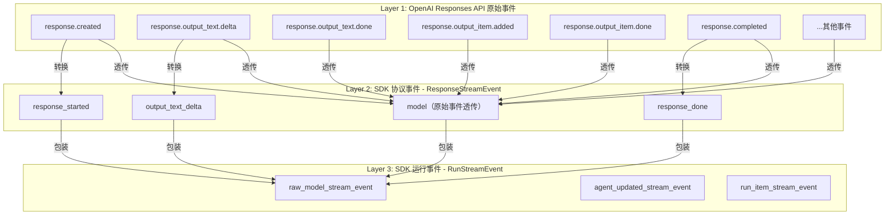
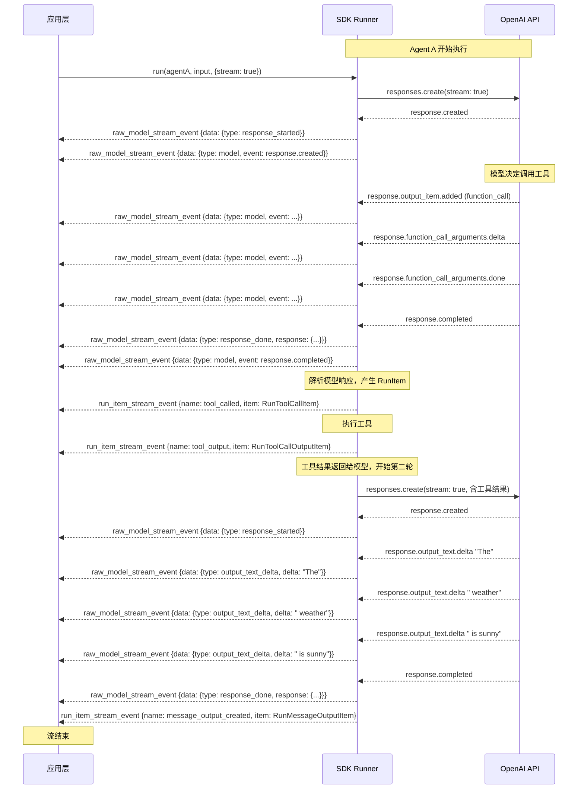
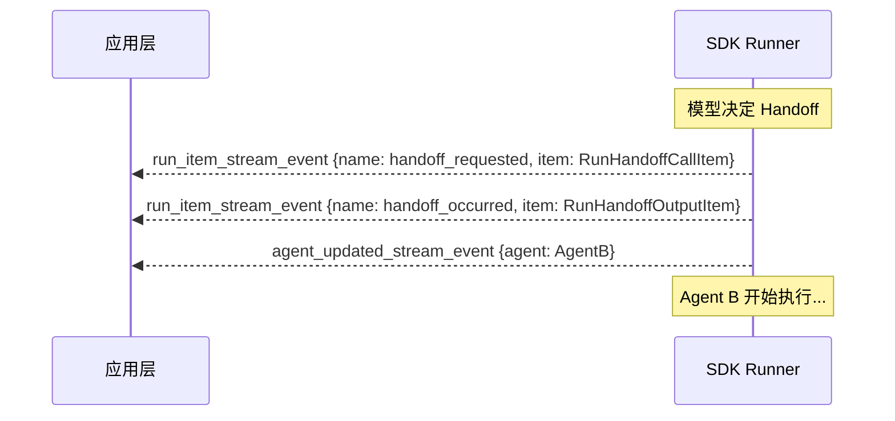

# 15 - 流式消息格式详解

> 来源：SDK 源码 `packages/agents-core/src/events.ts`, `packages/agents-core/src/types/protocol.ts`, `packages/agents-core/src/items.ts`, `packages/agents-openai/src/openaiResponsesModel.ts`

## 概述

本文档完整梳理 OpenAI Agents JS SDK 的流式消息格式体系。SDK 在 OpenAI Responses API 的原始事件之上构建了一套三层事件模型，理解这套格式对于消息转化和前端展示至关重要。

## 三层事件架构



## Layer 1: OpenAI Responses API 原始事件

这是 OpenAI API 返回的原始 Server-Sent Events。SDK 通过 `OpenAIResponsesModel` 接收这些事件。

### 原始事件类型列表

| 事件类型                                 | 说明         | 触发时机             |
| ---------------------------------------- | ------------ | -------------------- |
| `response.created`                       | 响应创建     | 请求开始             |
| `response.in_progress`                   | 响应处理中   | 模型开始生成         |
| `response.output_item.added`             | 新输出项添加 | 模型产生新内容块     |
| `response.output_item.done`              | 输出项完成   | 一个内容块生成完毕   |
| `response.content_part.added`            | 内容部分添加 | 输出项中的子部分开始 |
| `response.content_part.done`             | 内容部分完成 | 子部分完成           |
| `response.output_text.delta`             | 文本增量     | 每个 token 输出      |
| `response.output_text.done`              | 文本完成     | 一段文本输出完毕     |
| `response.function_call_arguments.delta` | 函数参数增量 | 工具调用参数流式输出 |
| `response.function_call_arguments.done`  | 函数参数完成 | 工具调用参数输出完毕 |
| `response.completed`                     | 响应完成     | 全部输出完毕         |
| `response.failed`                        | 响应失败     | 出现错误             |

> 这些事件类型来自 OpenAI SDK 的 `ResponseStreamEvent` 类型（`openai/resources/responses/responses`）。

## Layer 2: SDK 协议事件（ResponseStreamEvent / StreamEvent）

SDK 将 OpenAI 原始事件转换为统一的协议事件格式，这层抽象使 SDK 可以支持不同的模型提供者。

### 协议事件定义

```typescript
// 文件: packages/agents-core/src/types/protocol.ts

type StreamEvent =
  | StreamEventTextStream // output_text_delta
  | StreamEventResponseCompleted // response_done
  | StreamEventResponseStarted // response_started
  | StreamEventGenericItem // model（透传原始事件）
```

### 各协议事件的详细格式

#### 1. `response_started` — 响应开始

```typescript
interface StreamEventResponseStarted {
  type: 'response_started'
  providerData?: Record<string, any> // 原始 OpenAI 事件数据
}
```

#### 2. `output_text_delta` — 文本增量（最常用）

```typescript
interface StreamEventTextStream {
  type: 'output_text_delta'
  delta: string // 增量文本内容
  providerData?: Record<string, any> // 原始事件的额外数据
}
```

这是实现"打字机效果"的核心事件。`toTextStream()` 方法只提取这个事件的 `delta` 字段。

#### 3. `response_done` — 响应完成

```typescript
interface StreamEventResponseCompleted {
  type: 'response_done'
  response: {
    id: string // 响应 ID
    output: OutputModelItem[] // 完整的输出项列表
    usage: UsageData // Token 用量统计
  }
  providerData?: Record<string, any>
}

// UsageData 结构
interface UsageData {
  inputTokens: number
  outputTokens: number
  totalTokens: number
  inputTokensDetails?: {
    cached_tokens?: number
  }
  outputTokensDetails?: {
    reasoning_tokens?: number
  }
  requestUsageEntries?: Array<{
    inputTokens: number
    outputTokens: number
    totalTokens: number
    source: string
  }>
}
```

#### 4. `model` — 原始事件透传

```typescript
interface StreamEventGenericItem {
  type: 'model'
  event: any // OpenAI ResponseStreamEvent 原始事件
}
```

**关键点**：所有 OpenAI 原始事件都会产生一个 `model` 类型的事件。某些事件（`response.created`, `response.completed`, `response.output_text.delta`）还会额外产生对应的 SDK 协议事件。

### 转换规则

```
OpenAI 原始事件                    SDK 协议事件
─────────────────                 ──────────────────
response.created           →      response_started + model
response.output_text.delta →      output_text_delta + model
response.completed         →      response_done + model
其他所有事件               →      model（仅透传）
```

## Layer 3: SDK 运行事件（RunStreamEvent）

这是应用层消费的最终事件格式，通过 `toStream()` 或直接迭代获取。

### RunStreamEvent 联合类型

```typescript
// 文件: packages/agents-core/src/events.ts

type RunStreamEvent =
  | RunRawModelStreamEvent // raw_model_stream_event
  | RunItemStreamEvent // run_item_stream_event
  | RunAgentUpdatedStreamEvent // agent_updated_stream_event
```

### 事件 1: `raw_model_stream_event`

包装 Layer 2 的协议事件，`data` 字段就是 `StreamEvent`：

```typescript
class RunRawModelStreamEvent {
  readonly type = 'raw_model_stream_event'
  data: ResponseStreamEvent // StreamEvent 类型
}
```

**`data` 的四种可能值**：

| data.type             | 含义         | 关键字段                                                          |
| --------------------- | ------------ | ----------------------------------------------------------------- |
| `'output_text_delta'` | 文本增量     | `data.delta: string`                                              |
| `'response_started'`  | 响应开始     | `data.providerData`                                               |
| `'response_done'`     | 响应完成     | `data.response.id`, `data.response.output`, `data.response.usage` |
| `'model'`             | 原始事件透传 | `data.event: OpenAI.ResponseStreamEvent`                          |

### 事件 2: `run_item_stream_event`

Agent 处理模型响应后产生的高级事件：

```typescript
class RunItemStreamEvent {
  readonly type = 'run_item_stream_event'
  name: RunItemStreamEventName // 事件名称
  item: RunItem // 运行项
}
```

#### RunItemStreamEventName 枚举

| name 值                     | 含义           | 对应的 RunItem 类型     |
| --------------------------- | -------------- | ----------------------- |
| `'message_output_created'`  | Agent 输出消息 | `RunMessageOutputItem`  |
| `'tool_called'`             | 工具被调用     | `RunToolCallItem`       |
| `'tool_output'`             | 工具返回结果   | `RunToolCallOutputItem` |
| `'handoff_requested'`       | 请求 Handoff   | `RunHandoffCallItem`    |
| `'handoff_occurred'`        | Handoff 完成   | `RunHandoffOutputItem`  |
| `'reasoning_item_created'`  | 推理内容       | `RunReasoningItem`      |
| `'tool_approval_requested'` | 工具需审批     | `RunToolApprovalItem`   |

### 事件 3: `agent_updated_stream_event`

Agent 发生切换（Handoff 后）：

```typescript
class RunAgentUpdatedStreamEvent {
  readonly type = 'agent_updated_stream_event'
  agent: Agent // 新的活跃 Agent
}
```

## RunItem 完整类型定义

`run_item_stream_event` 中的 `item` 字段是以下类型之一：

### RunItem 联合类型

```typescript
type RunItem =
  | RunMessageOutputItem // 消息输出
  | RunToolCallItem // 工具调用
  | RunToolCallOutputItem // 工具输出
  | RunReasoningItem // 推理内容
  | RunHandoffCallItem // Handoff 调用
  | RunHandoffOutputItem // Handoff 输出
  | RunToolApprovalItem // 工具审批
```

### 各 RunItem 的详细结构

#### RunMessageOutputItem

```typescript
class RunMessageOutputItem {
  readonly type = 'message_output_item';
  rawItem: AssistantMessageItem;  // 原始消息数据
  agent: Agent;                    // 所属 Agent

  // 便捷属性：提取纯文本内容
  get content(): string {
    let content = '';
    for (const part of this.rawItem.content) {
      if (part.type === 'output_text') {
        content += part.text;
      }
    }
    return content;
  }
}

// AssistantMessageItem 结构
interface AssistantMessageItem {
  type: 'message';
  role: 'assistant';
  status: 'in_progress' | 'completed' | 'incomplete';
  content: AssistantContent[];  // 内容数组
}

// AssistantContent 可能的类型
type AssistantContent =
  | { type: 'output_text'; text: string }        // 文本
  | { type: 'refusal'; refusal: string }          // 拒绝
  | { type: 'output_audio'; ... }                 // 音频
  | { type: 'output_image'; ... };                // 图片
```

#### RunToolCallItem

```typescript
class RunToolCallItem {
  readonly type = 'tool_call_item'
  rawItem: ToolCallItem // 可能是以下之一
  agent: Agent
}

// ToolCallItem 联合类型
type ToolCallItem =
  | FunctionCallItem // 函数调用
  | HostedToolCallItem // 托管工具调用（web_search 等）
  | ComputerUseCallItem // 计算机操作
  | ShellCallItem // Shell 命令
  | ApplyPatchCallItem // 补丁应用

// FunctionCallItem 结构（最常用）
interface FunctionCallItem {
  type: 'function_call'
  callId: string // 调用 ID
  name: string // 函数名
  arguments: string // JSON 字符串格式的参数
  status?: 'in_progress' | 'completed' | 'incomplete'
}

// HostedToolCallItem 结构
interface HostedToolCallItem {
  type: 'hosted_tool_call'
  name: string // 工具名（如 'web_search_call'）
  arguments?: string // 参数
  status: 'in_progress' | 'completed' | 'incomplete'
}
```

#### RunToolCallOutputItem

```typescript
class RunToolCallOutputItem {
  readonly type = 'tool_call_output_item'
  rawItem: FunctionCallResultItem // 原始结果数据
  agent: Agent
  output: string | unknown // 工具输出内容
}

// FunctionCallResultItem 结构
interface FunctionCallResultItem {
  type: 'function_call_result'
  name: string // 工具名
  callId: string // 对应的调用 ID
  status: 'in_progress' | 'completed' | 'incomplete'
  output: string // 序列化的输出
}
```

#### RunReasoningItem

```typescript
class RunReasoningItem {
  readonly type = 'reasoning_item'
  rawItem: ReasoningItem // 推理数据
  agent: Agent
}

// ReasoningItem 结构
interface ReasoningItem {
  type: 'reasoning'
  id?: string
  content: Array<{ type: 'input_text'; text: string }> // 用户可见的推理摘要
  rawContent?: Array<{
    // 原始推理文本
    type: 'reasoning_text'
    text: string
    signature?: string
  }>
}
```

#### RunHandoffCallItem

```typescript
class RunHandoffCallItem {
  readonly type = 'handoff_call_item'
  rawItem: FunctionCallItem // Handoff 本质是函数调用
  agent: Agent // 发起 Handoff 的 Agent
}
```

#### RunHandoffOutputItem

```typescript
class RunHandoffOutputItem {
  readonly type = 'handoff_output_item'
  rawItem: FunctionCallResultItem
  sourceAgent: Agent // 源 Agent
  targetAgent: Agent // 目标 Agent
}
```

#### RunToolApprovalItem

```typescript
class RunToolApprovalItem {
  readonly type = 'tool_approval_item';
  rawItem: FunctionCallItem | HostedToolCallItem | ...;
  agent: Agent;
  toolName?: string;      // 工具名

  get name(): string | undefined;       // 工具名
  get arguments(): string | undefined;  // 工具参数
}
```

## 完整事件时序图

一次典型的 Agent 执行（含工具调用和 Handoff）的完整事件流：



### Handoff 场景的额外事件



## 消息转化实用指南

### 场景 1：提取纯文本（打字机效果）

```typescript
const stream = await run(agent, input, { stream: true })

for await (const event of stream) {
  if (event.type === 'raw_model_stream_event' && event.data.type === 'output_text_delta') {
    // event.data.delta 是文本增量
    appendToUI(event.data.delta)
  }
}

// 或者直接使用 toTextStream()
for await (const delta of stream.toTextStream()) {
  appendToUI(delta)
}
```

### 场景 2：追踪工具调用

```typescript
for await (const event of stream) {
  if (event.type === 'run_item_stream_event') {
    switch (event.name) {
      case 'tool_called':
        // event.item.type === 'tool_call_item'
        const toolCall = event.item as RunToolCallItem
        showToolCallStart(toolCall.rawItem.name, toolCall.rawItem.arguments)
        break

      case 'tool_output':
        // event.item.type === 'tool_call_output_item'
        const toolOutput = event.item as RunToolCallOutputItem
        showToolCallResult(toolOutput.output)
        break
    }
  }
}
```

### 场景 3：追踪 Agent 切换

```typescript
for await (const event of stream) {
  if (event.type === 'agent_updated_stream_event') {
    updateCurrentAgent(event.agent.name)
  }
}
```

### 场景 4：获取推理过程

```typescript
for await (const event of stream) {
  if (event.type === 'run_item_stream_event' && event.name === 'reasoning_item_created') {
    const reasoning = event.item as RunReasoningItem
    for (const entry of reasoning.rawItem.content) {
      if (entry.type === 'input_text') {
        showThinking(entry.text)
      }
    }
  }
}
```

### 场景 5：获取 Token 用量

```typescript
for await (const event of stream) {
  if (event.type === 'raw_model_stream_event' && event.data.type === 'response_done') {
    const usage = event.data.response.usage
    updateTokenCount({
      input: usage.inputTokens,
      output: usage.outputTokens,
      total: usage.totalTokens
    })
  }
}
```

### 场景 6：获取 OpenAI 原始事件

```typescript
for await (const event of stream) {
  if (event.type === 'raw_model_stream_event' && event.data.type === 'model') {
    // event.data.event 是 OpenAI ResponseStreamEvent 原始对象
    const oaiEvent = event.data.event
    console.log(`OpenAI event: ${oaiEvent.type}`)

    // 可以获取工具调用参数的增量
    if (oaiEvent.type === 'response.function_call_arguments.delta') {
      showArgumentsDelta(oaiEvent.delta)
    }

    // 可以获取输出项完成事件
    if (oaiEvent.type === 'response.output_item.done') {
      handleItemComplete(oaiEvent.item)
    }
  }
}
```

### 场景 7：处理 HITL 中断

```typescript
for await (const event of stream) {
  if (event.type === 'run_item_stream_event' && event.name === 'tool_approval_requested') {
    const approval = event.item as RunToolApprovalItem
    showApprovalDialog({
      agent: approval.agent.name,
      tool: approval.name,
      args: approval.arguments
    })
  }
}
```

## 与 OpenAI 原始格式的关系

### 一致性

| 方面       | SDK 格式                  | OpenAI 原始格式                    | 关系                   |
| ---------- | ------------------------- | ---------------------------------- | ---------------------- |
| 文本增量   | `output_text_delta.delta` | `response.output_text.delta.delta` | **一致**，字段名映射   |
| 响应完成   | `response_done.response`  | `response.completed.response`      | **一致**，结构映射     |
| Token 用量 | `usage.inputTokens`       | `usage.input_tokens`               | **一致**，驼峰命名映射 |
| 原始事件   | `model.event`             | 原始事件                           | **完全透传**           |

### 差异点

| 方面         | SDK 额外提供                 | OpenAI 原始无                      |
| ------------ | ---------------------------- | ---------------------------------- |
| RunItem 事件 | `run_item_stream_event`      | 无（需要自行解析 response output） |
| Agent 切换   | `agent_updated_stream_event` | 无（SDK 概念）                     |
| 工具审批     | `tool_approval_requested`    | 无（SDK HITL 机制）                |
| Handoff 事件 | `handoff_requested/occurred` | 无（SDK Handoff 机制）             |
| 工具输出     | `tool_output`                | 无（需要自行管理工具调用）         |

### 核心结论

> SDK 的 `raw_model_stream_event` 中通过 `data.type === 'model'` 可以获取 OpenAI 的**完整原始事件**，与直接使用 OpenAI API 的体验完全一致。SDK 在此基础上额外提供了 `run_item_stream_event` 和 `agent_updated_stream_event` 作为高级抽象，封装了工具执行、Handoff 切换等 Agent 特有的逻辑。

## 事件类型速查表

### RunStreamEvent（顶层）

| type                         | 子类型                             | 说明                 |
| ---------------------------- | ---------------------------------- | -------------------- |
| `raw_model_stream_event`     | `data.type = 'output_text_delta'`  | 文本增量             |
| `raw_model_stream_event`     | `data.type = 'response_started'`   | 响应开始             |
| `raw_model_stream_event`     | `data.type = 'response_done'`      | 响应完成（含 usage） |
| `raw_model_stream_event`     | `data.type = 'model'`              | OpenAI 原始事件透传  |
| `run_item_stream_event`      | `name = 'message_output_created'`  | Agent 输出消息       |
| `run_item_stream_event`      | `name = 'tool_called'`             | 工具被调用           |
| `run_item_stream_event`      | `name = 'tool_output'`             | 工具返回结果         |
| `run_item_stream_event`      | `name = 'handoff_requested'`       | 请求 Handoff         |
| `run_item_stream_event`      | `name = 'handoff_occurred'`        | Handoff 完成         |
| `run_item_stream_event`      | `name = 'reasoning_item_created'`  | 推理内容             |
| `run_item_stream_event`      | `name = 'tool_approval_requested'` | 工具需审批           |
| `agent_updated_stream_event` | —                                  | Agent 切换           |

### 文档导航

返回 [README.md](./README.md) 查看完整文档目录。
