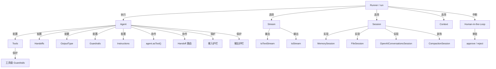

# OpenAI Agents JS SDK 功能文档

> 基于 `@openai/agents` SDK 的完整功能参考文档，所有示例均来源于官方 openai-agents-js 仓库。

## 核心概念关系

## 文档目录

| 编号 | 文档                                                   | 说明                              | 适用场景           |
| ---- | ------------------------------------------------------ | --------------------------------- | ------------------ |
| 01   | [快速入门](./01-quick-start.md)                        | 最简 Agent 创建和运行             | 初次接触 SDK       |
| 02   | [Agent 与 Runner](./02-agent-and-runner.md)            | Agent 配置、Runner 用法、模型选择 | 理解核心概念       |
| 03   | [工具系统](./03-tools.md)                              | 工具定义、执行、行为控制          | 给 Agent 添加能力  |
| 04   | [结构化输出](./04-structured-output.md)                | Zod / JSON Schema 输出类型        | 需要格式化返回值   |
| 05   | [流式处理](./05-streaming.md)                          | 文本流、事件流、流式事件处理      | 实时输出、进度展示 |
| 06   | [Handoff 与路由](./06-handoff-and-routing.md)          | Agent 间任务移交和路由            | 多 Agent 协作      |
| 07   | [多模态](./07-multimodal.md)                           | 图片、文件、PDF 处理              | 处理非文本内容     |
| 08   | [生命周期钩子](./08-lifecycle-hooks.md)                | 事件监听、使用量统计              | 监控和调试         |
| 09   | [上下文与动态指令](./09-context-and-dynamic-prompt.md) | 自定义上下文、动态 Prompt         | 运行时定制行为     |
| 10   | [记忆与会话管理](./10-memory-session.md)               | Session 接口、持久化、压缩        | 多轮对话、历史管理 |
| 11   | [Human-in-the-Loop](./11-hitl.md)                      | 工具审批、中断恢复                | 需要人工确认的场景 |
| 12   | [护栏系统](./12-guardrails.md)                         | 输入/输出/流式护栏                | 安全防护、内容过滤 |
| 13   | [Agent 设计模式](./13-agent-patterns.md)               | 常用架构模式和最佳实践            | 架构设计参考       |
| 14   | [高级特性](./14-advanced-features.md)                  | 追踪、Reasoning、工具函数         | 高级配置和调优     |

## 快速导航

**我想要...**

- **快速上手** → [01-quick-start.md](./01-quick-start.md)
- **让 Agent 调用外部 API** → [03-tools.md](./03-tools.md)
- **让 Agent 返回 JSON** → [04-structured-output.md](./04-structured-output.md)
- **实现打字机效果** → [05-streaming.md](./05-streaming.md)
- **多个 Agent 协作** → [06-handoff-and-routing.md](./06-handoff-and-routing.md) + [13-agent-patterns.md](./13-agent-patterns.md)
- **处理图片和文件** → [07-multimodal.md](./07-multimodal.md)
- **保存对话历史** → [10-memory-session.md](./10-memory-session.md)
- **人工审批工具调用** → [11-hitl.md](./11-hitl.md)
- **防止有害输出** → [12-guardrails.md](./12-guardrails.md)
- **监控 Token 用量** → [08-lifecycle-hooks.md](./08-lifecycle-hooks.md)

## 示例来源

本文档中的所有代码示例均来自以下目录：

- `openai-agents-js/examples/basic/` — 基础功能示例
- `openai-agents-js/examples/memory/` — 记忆与会话管理示例
- `openai-agents-js/examples/agent-patterns/` — Agent 设计模式示例
