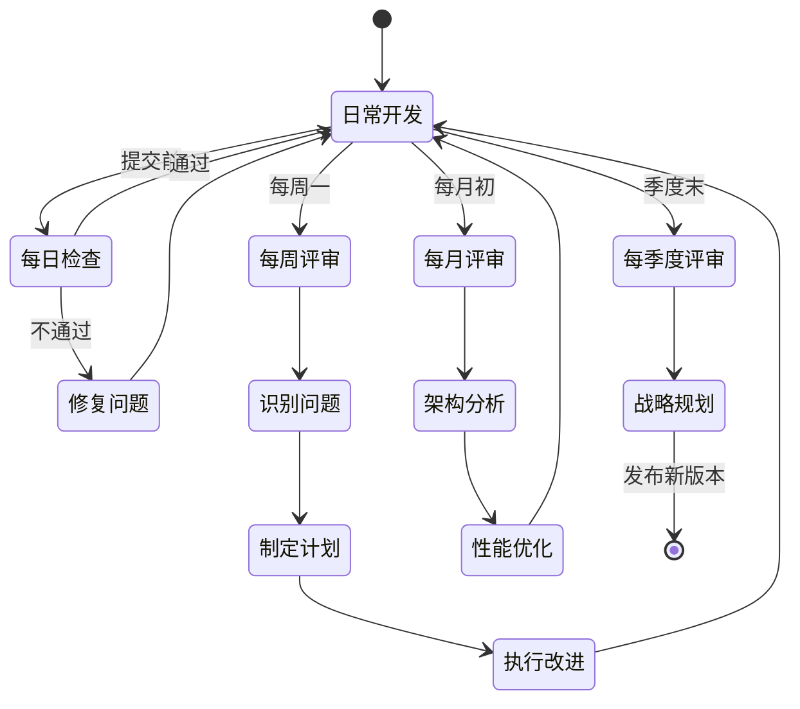

# AI 模块定期架构评审机制

## 概述

本文档定义了 AI 模块的定期架构评审流程，确保代码质量和架构健康度的持续维护。

---

## 评审频率

### 每日检查（自动化）

- **频率**: 每次提交前
- **工具**: Pre-commit hooks
- **内容**:
  - TypeScript 类型检查
  - ESLint 代码规范
  - 格式检查

**执行方式**:

```bash
pnpm run review
```

### 每周评审（人工 + 自动化）

- **频率**: 每周一上午
- **时长**: 1-2小时
- **参与人**: 核心开发者
- **内容**:
  1. 运行完整自动化检查
  2. 审查本周新增代码
  3. 检查性能指标
  4. 讨论技术债务

**评审清单**:

- [ ] 运行 `pnpm run review`
- [ ] 审查 Git 提交记录
- [ ] 检查性能监控指标
- [ ] 审查开放的 Issue
- [ ] 更新技术债务列表

### 每月评审（架构级）

- **频率**: 每月第一个周五
- **时长**: 3-4小时
- **参与人**: 全体开发者 + 架构师
- **内容**:
  1. 整体架构健康度评估
  2. 模块间依赖关系审查
  3. 性能瓶颈分析
  4. 技术选型评审
  5. 下月改进计划

**评审维度**:

- 功能完整性
- 架构清晰性
- 代码质量
- 系统性能
- 可维护性
- 文档完整性

### 每季度评审（战略级）

- **频率**: 每季度末
- **时长**: 1天
- **参与人**: 全体团队 + 产品经理
- **内容**:
  1. 季度目标完成情况
  2. 技术债务清理
  3. 架构演进规划
  4. 技术升级评估
  5. 下季度 OKR 制定

---

## 评审流程

### 1. 准备阶段

**时间**: 评审前2天

**任务**:

- 收集性能数据
- 整理 Issue 列表
- 准备评审材料
- 发送评审邀请

**材料清单**:

```
1. 性能监控报告
2. 代码提交统计
3. Issue 分析报告
4. 技术债务清单
5. 上次评审的行动项进展
```

### 2. 执行阶段

**流程**:


#### 2.1 自动化检查（15分钟）

```bash
# 运行完整检查
pnpm run review

# 查看性能指标
# (通过监控服务 API)
```

#### 2.2 人工审查（30-60分钟）

- 代码审查（关注新增和修改）
- 架构图审查（是否与代码一致）
- 文档审查（是否同步）
- 依赖关系审查（是否合理）

#### 2.3 问题讨论（30-60分钟）

- 识别的问题
- 技术债务
- 改进建议
- 风险评估

#### 2.4 制定改进计划（30分钟）

- 优先级排序（P0/P1/P2）
- 估算工作量
- 分配责任人
- 设定期限

#### 2.5 记录评审结果（15分钟）

- 填写评审表单
- 创建 Issue
- 更新文档
- 发送评审纪要

### 3. 跟踪阶段

**行动项跟踪**:

- 每个行动项创建 Issue
- 设置优先级和里程碑
- 定期检查完成情况
- 下次评审时验收

---

## 评审表单

### 每周评审表单

**日期**: `____________`  
**参与人**: `____________`

#### 代码质量检查

- [ ] TypeScript 类型检查通过
- [ ] ESLint 检查通过
- [ ] 架构 Lint 检查通过
- [ ] 格式检查通过

#### 新增代码审查

| 文件 | 变更类型 | 审查状态        | 备注 |
| ---- | -------- | --------------- | ---- |
|      |          | ☐ 通过 ☐ 需改进 |      |
|      |          | ☐ 通过 ☐ 需改进 |      |

#### 性能指标

| 模块 | 操作 | 平均耗时 | P95 | 状态          |
| ---- | ---- | -------- | --- | ------------- |
|      |      |          |     | ☐ 正常 ☐ 告警 |
|      |      |          |     | ☐ 正常 ☐ 告警 |

#### 发现的问题

1.
2.
3.

#### 行动项

- [ ] 任务1 - 责任人: **\_** - 期限: **\_**
- [ ] 任务2 - 责任人: **\_** - 期限: **\_**

---

### 每月评审表单

**日期**: `____________`  
**参与人**: `____________`

#### 架构健康度评估

| 维度       | 评分(1-5) | 说明 |
| ---------- | --------- | ---- |
| 功能完整性 |           |      |
| 架构清晰性 |           |      |
| 代码质量   |           |      |
| 系统性能   |           |      |
| 可维护性   |           |      |
| 文档完整性 |           |      |

**总体评分**: `____/30`

**评级**:

- 25-30: 优秀 ✅
- 20-24: 良好 ⚠️
- 15-19: 需改进 ⚠️
- < 15: 不合格 ❌

#### 关键指标

| 指标          | 本月 | 上月 | 趋势  |
| ------------- | ---- | ---- | ----- |
| 类型错误数    |      |      | ↗️↘️→ |
| ESLint 错误数 |      |      | ↗️↘️→ |
| TODO 数量     |      |      | ↗️↘️→ |
| 测试覆盖率    |      |      | ↗️↘️→ |
| 平均响应时间  |      |      | ↗️↘️→ |

#### 技术债务

**新增技术债务**:

1.
2.

**已清理技术债务**:

1.
2.

**优先级排序**:

- P0 (必须本月清理):
- P1 (建议本月清理):
- P2 (可延后):

#### 改进计划

**本月完成目标**:

- **下月重点工作**:

1.
2.
3.

---

## 评审指标

### 代码质量指标

| 指标           | 目标  | 当前 | 状态 |
| -------------- | ----- | ---- | ---- |
| 类型检查通过率 | 100%  |      |      |
| ESLint 错误数  | 0     |      |      |
| 测试覆盖率     | > 80% |      |      |
| TODO 数量      | 0     |      |      |
| 循环依赖数     | 0     |      |      |

### 架构质量指标

| 指标           | 目标 | 当前 | 状态 |
| -------------- | ---- | ---- | ---- |
| 模块职责清晰度 | 5/5  |      |      |
| 依赖关系合理性 | 5/5  |      |      |
| 接口完整性     | 5/5  |      |      |
| 文档同步度     | 100% |      |      |

### 性能指标

| 操作       | 目标    | P50 | P95 | P99 | 状态 |
| ---------- | ------- | --- | --- | --- | ---- |
| Agent 创建 | < 1s    |     |     |     |      |
| 任务执行   | < 30s   |     |     |     |      |
| 计划生成   | < 10s   |     |     |     |      |
| 消息写入   | < 100ms |     |     |     |      |

---

## 评审输出

### 评审报告模板

```markdown
# AI 模块架构评审报告

**日期**: YYYY-MM-DD  
**类型**: 每周/每月/每季度  
**参与人**: XXX, YYY, ZZZ

## 评审概要

**总体评分**: X/30 (优秀/良好/需改进/不合格)

## 主要发现

### 正向进展

1.
2.

### 存在问题

1.
2.

### 风险识别

1.
2.

## 改进计划

| 问题 | 优先级   | 负责人 | 期限 | 状态 |
| ---- | -------- | ------ | ---- | ---- |
|      | P0/P1/P2 |        |      |      |

## 下次评审重点

1.
2.

## 附件

- 性能监控报告
- 代码统计报告
- 技术债务清单
```

### 评审纪要存档

所有评审纪要保存在: `docs/ai-architecture/reviews/`

命名格式: `YYYY-MM-DD-weekly/monthly/quarterly-review.md`

---

## 自动化工具

### 评审脚本

**运行完整评审**:

```bash
pnpm run review
```

**单独运行各项检查**:

```bash
pnpm run typecheck      # 类型检查
pnpm run lint           # ESLint
pnpm lint:architecture  # 架构 Lint
pnpm run format:check   # 格式检查
```

### 性能监控

**查看性能统计**:

```typescript
import { performanceMonitor } from '@main/ai/monitoring';

// 获取统计
const stats = performanceMonitor.getStats();

// 获取最慢操作
const slowest = performanceMonitor.getSlowestOperations(10);

// 获取失败操作
const failed = performanceMonitor.getFailedOperations(20);
```

### 架构检查

**运行架构 Lint**:

```bash
pnpm run lint:architecture
```

**检查项**:

- 类型安全（any 使用、类型断言）
- 资源泄漏（定时器、事件监听器）
- TODO 遗留
- 命名规范
- 文档同步
- 导出完整性

---

## 持续改进循环



---

## 评审结果应用

### 问题分类

**立即修复** (P0):

- 阻塞性问题
- 安全漏洞
- 严重性能问题

**计划修复** (P1):

- 功能性问题
- 性能优化
- 架构改进

**可延后** (P2):

- 改进性问题
- 代码优化
- 文档完善

### Issue 创建

每个发现的问题创建对应 Issue：

**标题格式**: `[架构评审-YYYY-MM-DD] 问题描述`

**标签**:

- `architecture`: 架构相关
- `P0/P1/P2`: 优先级
- `tech-debt`: 技术债务
- `performance`: 性能问题

**内容模板**:

```markdown
## 问题描述

## 影响范围

## 建议方案

## 相关文件

-

## 责任人

@xxx

## 期限

YYYY-MM-DD
```

---

## 成功标准

### 评审质量标准

- [ ] 所有检查项都已执行
- [ ] 发现的问题都已记录
- [ ] 行动项都有责任人和期限
- [ ] 评审纪要已存档

### 改进效果标准

- [ ] P0 问题在1周内修复
- [ ] P1 问题在1月内修复
- [ ] 技术债务逐月减少
- [ ] 代码质量指标持续改善

---

## 工具和资源

### 检查工具

- TypeScript Compiler: 类型检查
- ESLint: 代码规范
- Prettier: 代码格式
- 自定义架构 Lint: 架构检查
- Performance Monitor: 性能监控

### 文档资源

- [架构规范](./13-architecture-standards.md)
- [评审 Checklist](./14-architecture-review-checklist.md)
- [改进计划模板](../.cursor/plans/)

### 自动化脚本

- `scripts/review.sh`: 完整评审
- `scripts/architecture-lint.ts`: 架构检查
- `src/main/ai/monitoring/PerformanceMonitor.ts`: 性能监控

---

## 评审记录

评审记录保存在 `docs/ai-architecture/reviews/` 目录：

```
docs/ai-architecture/reviews/
├── 2026-02/
│   ├── 2026-02-05-weekly-review.md
│   ├── 2026-02-12-weekly-review.md
│   └── 2026-02-28-monthly-review.md
└── 2026-03/
    └── ...
```

---

## 责任分工

### 评审组织者

- 安排评审时间
- 准备评审材料
- 主持评审会议
- 记录评审纪要

### 开发者

- 参与代码审查
- 提出改进建议
- 认领行动项
- 执行改进计划

### 架构师

- 评估架构健康度
- 指导架构改进
- 审批重大变更
- 制定技术规范

---

## 附录

### 评审会议议程模板

**每周评审会议（60分钟）**

1. 开场（5分钟）
   - 回顾上周行动项

2. 自动化检查（10分钟）
   - 运行 `pnpm run review`
   - 审查结果

3. 代码审查（20分钟）
   - 本周新增代码
   - 重点变更讨论

4. 性能分析（10分钟）
   - 查看性能指标
   - 识别瓶颈

5. 问题讨论（10分钟）
   - 技术债务
   - 改进建议

6. 行动项（5分钟）
   - 制定行动计划
   - 分配责任人

**每月评审会议（3小时）**

1. 开场（15分钟）
   - 上月回顾
   - 评审目标

2. 自动化检查（30分钟）
   - 完整质量检查
   - 性能基准测试

3. 架构审查（60分钟）
   - 模块架构分析
   - 依赖关系审查
   - 接口设计评审

4. 性能分析（30分钟）
   - 月度性能报告
   - 瓶颈识别
   - 优化建议

5. 技术债务（30分钟）
   - 债务盘点
   - 优先级排序
   - 清理计划

6. 改进计划（15分钟）
   - 下月目标
   - 责任分配
   - 时间规划

---

**文档版本**: v1.0.0  
**最后更新**: 2026-02-05  
**维护者**: AI Architecture Team
