# Coobee AI — 系统架构全景

> 最后更新：2026-02-22

---

## 一、全局架构分层

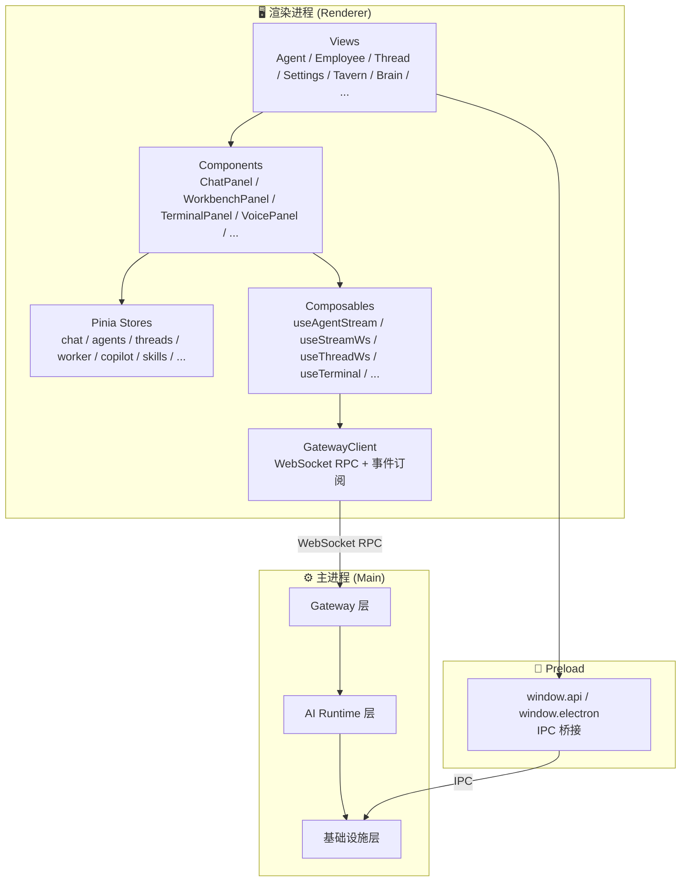

---

## 二、主进程架构详解

### 2.1 三层架构

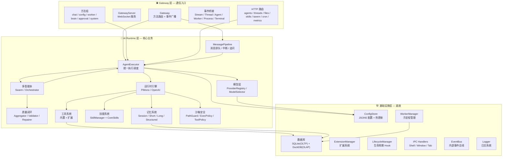

---

### 2.2 应用启动流程

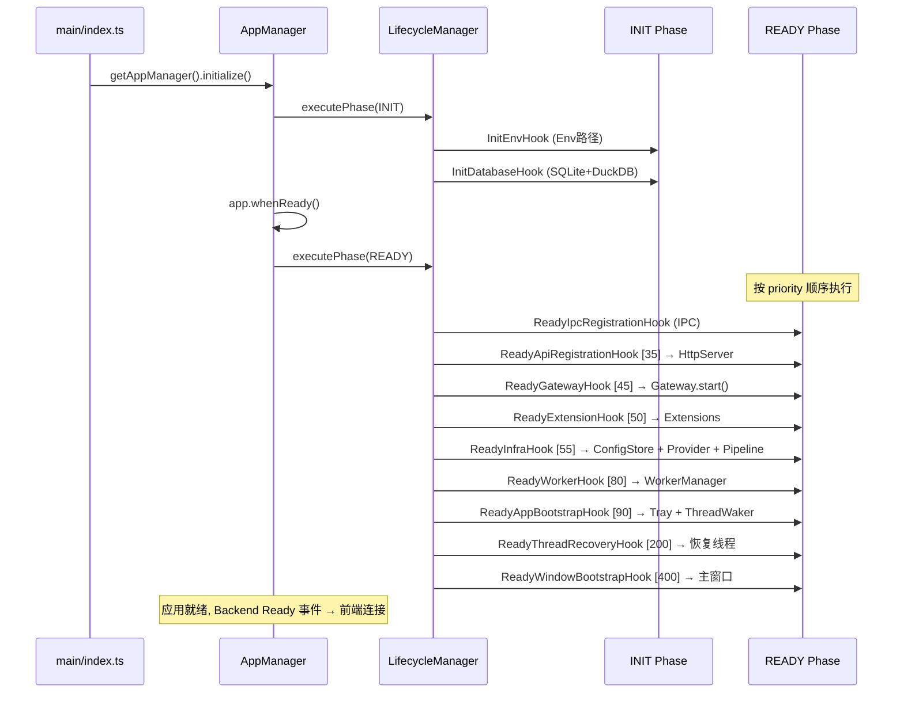

---

## 三、核心执行流——从用户消息到响应

### 3.1 聊天主流程

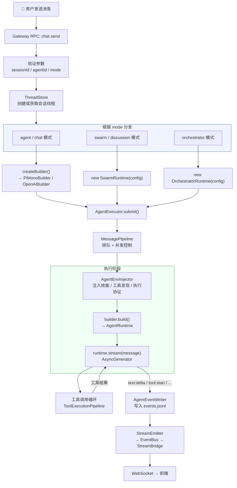

### 3.2 多智能体流程 — Swarm (蜂群)

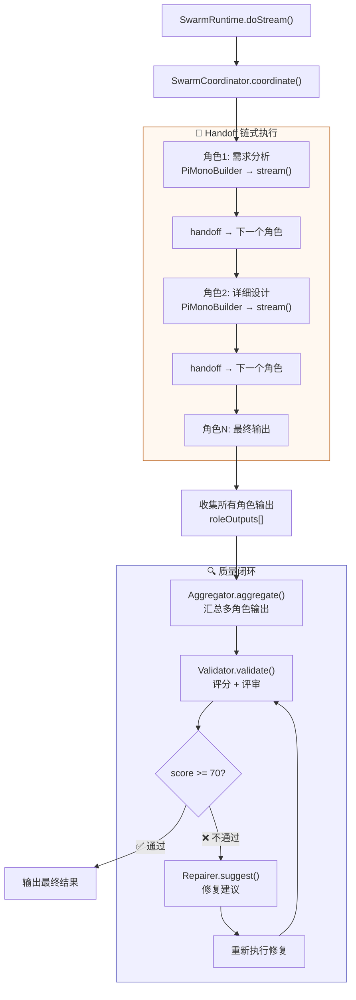

### 3.3 多智能体流程 — Orchestrator (编排)

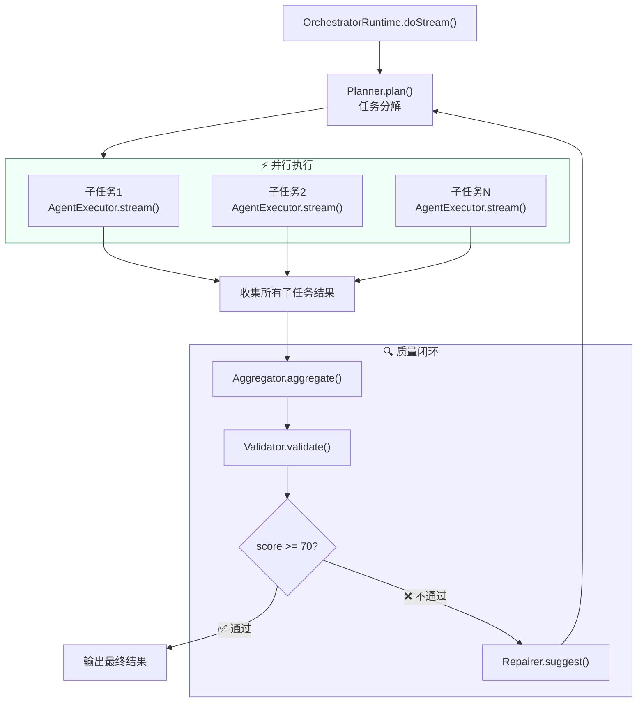

---

## 四、模型调用链

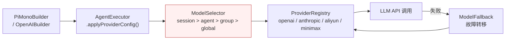

---

## 五、工具系统

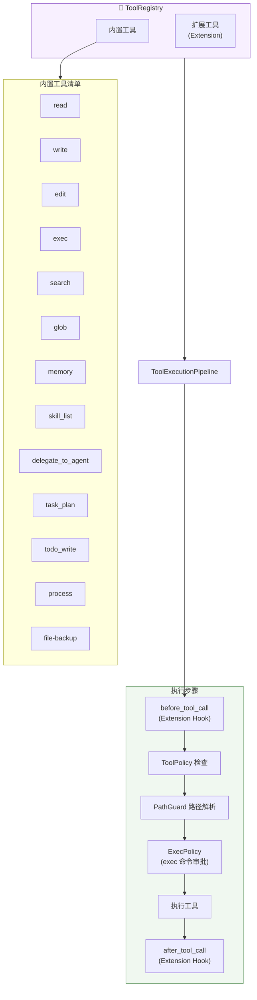

---

## 六、技能系统

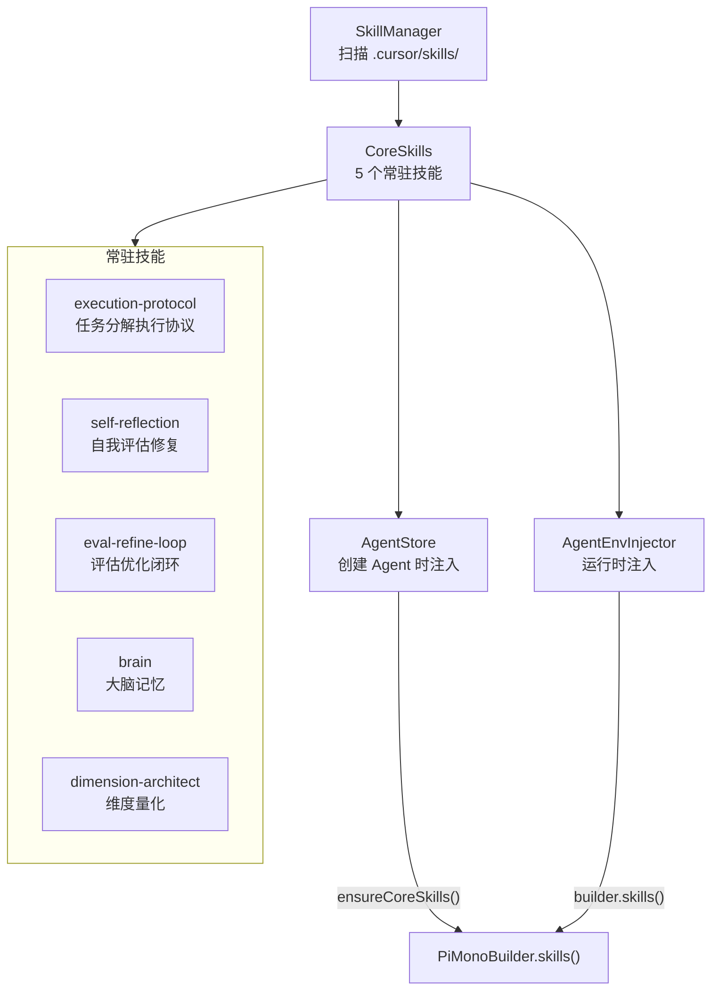

---

## 七、记忆系统

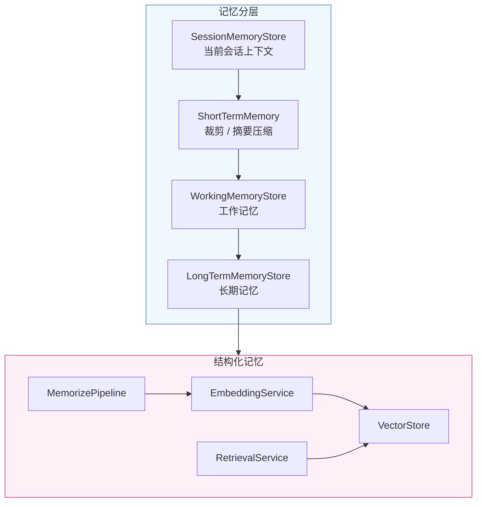

---

## 八、扩展系统 (Extension)

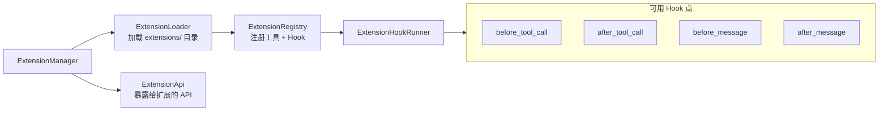

---

## 九、前端渲染进程架构

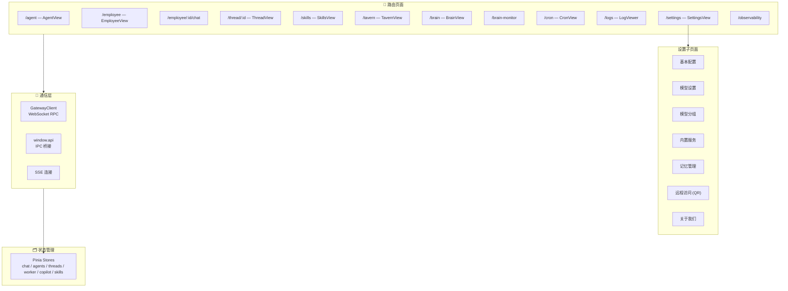

---

## 十、重点文件索引

### 10.1 核心入口

| 文件                           | 职责                             | 重要度 |
| ------------------------------ | -------------------------------- | ------ |
| `src/main/index.ts`            | 应用入口                         | ⭐⭐⭐ |
| `src/main/common/app/index.ts` | AppManager — 生命周期编排        | ⭐⭐⭐ |
| `src/main/common/Lifecycle.ts` | LifecycleManager — Hook 执行引擎 | ⭐⭐⭐ |

### 10.2 Gateway 层

| 文件                                 | 职责                                      | 重要度 |
| ------------------------------------ | ----------------------------------------- | ------ |
| `src/main/gateway/Gateway.ts`        | Gateway 核心 — 方法发现 + 路由 + 事件广播 | ⭐⭐⭐ |
| `src/main/gateway/GatewayServer.ts`  | WebSocket + HTTP 服务                     | ⭐⭐⭐ |
| `src/main/gateway/methods/chat.ts`   | 聊天入口 — 最关键的方法组                 | ⭐⭐⭐ |
| `src/main/gateway/methods/config.ts` | 配置方法组                                | ⭐⭐   |
| `src/main/gateway/methods/system.ts` | 系统方法组 (网络信息/QR码)                | ⭐     |

### 10.3 AI Runtime 层

| 文件                                                  | 职责                              | 重要度   |
| ----------------------------------------------------- | --------------------------------- | -------- |
| `src/main/ai/AgentExecutor.ts`                        | **统一执行调度器** — 最核心的文件 | ⭐⭐⭐⭐ |
| `src/main/ai/AgentEnvInjector.ts`                     | 环境注入 (技能/协议/工具发现)     | ⭐⭐⭐   |
| `src/main/ai/pipeline/MessagePipeline.ts`             | 消息管线 — 排队/中断/追问         | ⭐⭐⭐   |
| `src/main/ai/runtime/pimono/PiMonoBuilder.ts`         | PiMono 构建器 — Builder 模式核心  | ⭐⭐⭐   |
| `src/main/ai/runtime/pimono/PiMonoAgentRuntime.ts`    | PiMono 运行时实现                 | ⭐⭐⭐   |
| `src/main/ai/runtime/openai/OpenAIBuilder.ts`         | OpenAI 构建器                     | ⭐⭐⭐   |
| `src/main/ai/runtime/openai/OpenAIAgentRuntime.ts`    | OpenAI 运行时实现                 | ⭐⭐⭐   |
| `src/main/ai/runtime/AgentRuntime.ts`                 | 运行时接口定义                    | ⭐⭐⭐   |
| `src/main/ai/runtime/shared/ToolExecutionPipeline.ts` | 工具执行管线                      | ⭐⭐⭐   |

### 10.4 多智能体

| 文件                                               | 职责                                       | 重要度 |
| -------------------------------------------------- | ------------------------------------------ | ------ |
| `src/main/ai/swarm/SwarmRuntime.ts`                | Swarm 运行时 — Handoff/Parallel/Discussion | ⭐⭐⭐ |
| `src/main/ai/swarm/SwarmCoordinator.ts`            | Swarm 协调器 — 角色编排                    | ⭐⭐⭐ |
| `src/main/ai/orchestration/OrchestratorRuntime.ts` | 编排运行时 — 并行子任务                    | ⭐⭐⭐ |
| `src/main/ai/orchestration/Planner.ts`             | 任务分解计划器                             | ⭐⭐   |
| `src/main/ai/quality-loop/Validator.ts`            | 输出质量验证                               | ⭐⭐⭐ |
| `src/main/ai/quality-loop/Aggregator.ts`           | 多输出汇总                                 | ⭐⭐   |
| `src/main/ai/quality-loop/Repairer.ts`             | 修复建议                                   | ⭐⭐   |

### 10.5 工具 & 技能 & 安全

| 文件                                 | 职责             | 重要度 |
| ------------------------------------ | ---------------- | ------ |
| `src/main/ai/tools/registry.ts`      | 工具注册表       | ⭐⭐⭐ |
| `src/main/ai/tools/builtin/`         | 内置工具实现目录 | ⭐⭐⭐ |
| `src/main/ai/skills/SkillManager.ts` | 技能管理器       | ⭐⭐⭐ |
| `src/main/ai/skills/CoreSkills.ts`   | 核心技能定义     | ⭐⭐   |
| `src/main/ai/sandbox/path-guard.ts`  | 路径安全守卫     | ⭐⭐⭐ |
| `src/main/ai/sandbox/exec-policy.ts` | 命令执行策略     | ⭐⭐   |

### 10.6 模型 & 记忆

| 文件                                       | 职责              | 重要度 |
| ------------------------------------------ | ----------------- | ------ |
| `src/main/ai/provider/ProviderRegistry.ts` | 模型提供者注册    | ⭐⭐⭐ |
| `src/main/ai/provider/ModelSelector.ts`    | 模型选择策略      | ⭐⭐⭐ |
| `src/main/ai/provider/LLMService.ts`       | 统一 LLM 调用服务 | ⭐⭐   |
| `src/main/ai/memory/SessionMemoryStore.ts` | 会话记忆          | ⭐⭐   |
| `src/main/ai/agents/AgentStore.ts`         | Agent 定义存储    | ⭐⭐⭐ |

### 10.7 基础设施

| 文件                                            | 职责          | 重要度 |
| ----------------------------------------------- | ------------- | ------ |
| `src/main/common/config/ConfigStore.ts`         | 配置中心      | ⭐⭐⭐ |
| `src/main/common/database/SQLiteService.ts`     | SQLite 数据库 | ⭐⭐⭐ |
| `src/main/common/server/httpServer.ts`          | HTTP 服务器   | ⭐⭐⭐ |
| `src/main/common/worker/WorkerManager.ts`       | Worker 子进程 | ⭐⭐   |
| `src/main/common/extension/ExtensionManager.ts` | 扩展系统      | ⭐⭐   |

### 10.8 前端核心

| 文件                                              | 职责             | 重要度 |
| ------------------------------------------------- | ---------------- | ------ |
| `src/renderer/src/services/GatewayClient.ts`      | 前端 RPC 客户端  | ⭐⭐⭐ |
| `src/renderer/src/plugins/gatewaySetup.ts`        | Gateway 连接管理 | ⭐⭐⭐ |
| `src/renderer/src/composables/useAgentStream.ts`  | Agent 流式响应   | ⭐⭐⭐ |
| `src/renderer/src/components/agent/ChatPanel.vue` | 聊天面板         | ⭐⭐⭐ |
| `src/renderer/src/router/index.ts`                | 路由配置         | ⭐⭐   |

---

## 十一、代码目录树

```
src/
├── main/                           # 主进程
│   ├── index.ts                    # 入口
│   ├── ai/                         # 🧠 AI Runtime 核心
│   │   ├── AgentExecutor.ts        #   统一执行调度器
│   │   ├── AgentEnvInjector.ts     #   环境注入
│   │   ├── AgentEventWriter.ts     #   事件写入
│   │   ├── agents/                 #   Agent 定义存储
│   │   │   ├── AgentStore.ts
│   │   │   └── types.ts
│   │   ├── cron/                   #   定时任务
│   │   ├── hitl/                   #   人在回路审批
│   │   ├── memory/                 #   记忆系统
│   │   │   ├── SessionMemoryStore.ts
│   │   │   ├── ShortTermMemory.ts
│   │   │   ├── WorkingMemoryStore.ts
│   │   │   ├── LongTermMemoryStore.ts
│   │   │   └── structured/        #   结构化向量记忆
│   │   ├── metrics/                #   指标
│   │   ├── orchestration/          #   编排器 (并行子任务)
│   │   │   ├── OrchestratorRuntime.ts
│   │   │   ├── Planner.ts
│   │   │   └── WorkerCoordinator.ts
│   │   ├── pipeline/               #   消息管线
│   │   │   ├── MessagePipeline.ts
│   │   │   ├── SessionQueue.ts
│   │   │   └── AbortManager.ts
│   │   ├── process/                #   进程管理
│   │   ├── provider/               #   模型提供者
│   │   │   ├── ProviderRegistry.ts
│   │   │   ├── ModelSelector.ts
│   │   │   ├── LLMService.ts
│   │   │   └── builtin/           #   openai / anthropic / aliyun / minimax
│   │   ├── quality-loop/           #   质量闭环
│   │   │   ├── Aggregator.ts
│   │   │   ├── Validator.ts
│   │   │   └── Repairer.ts
│   │   ├── runtime/                #   运行时引擎
│   │   │   ├── AgentRuntime.ts     #   接口定义
│   │   │   ├── AbstractAgentRuntime.ts
│   │   │   ├── pimono/            #   PiMono 引擎
│   │   │   │   ├── PiMonoBuilder.ts
│   │   │   │   └── PiMonoAgentRuntime.ts
│   │   │   ├── openai/            #   OpenAI 引擎
│   │   │   │   ├── OpenAIBuilder.ts
│   │   │   │   └── OpenAIAgentRuntime.ts
│   │   │   ├── shared/            #   共享管线
│   │   │   │   └── ToolExecutionPipeline.ts
│   │   │   └── services/          #   运行时服务
│   │   ├── sandbox/                #   沙箱安全
│   │   │   ├── path-guard.ts
│   │   │   ├── exec-policy.ts
│   │   │   └── tool-policy.ts
│   │   ├── services/               #   AI 服务
│   │   ├── skills/                 #   技能系统
│   │   │   ├── SkillManager.ts
│   │   │   └── CoreSkills.ts
│   │   ├── storage/                #   存储管理
│   │   ├── streaming/              #   流式输出
│   │   │   ├── StreamEmitter.ts
│   │   │   └── consumers/
│   │   ├── swarm/                  #   蜂群多智能体
│   │   │   ├── SwarmRuntime.ts
│   │   │   ├── SwarmCoordinator.ts
│   │   │   ├── SwarmContext.ts
│   │   │   ├── HandoffRouter.ts
│   │   │   └── roles/
│   │   ├── tavern/                 #   酒馆任务调度
│   │   ├── threads/                #   会话线程
│   │   └── tools/                  #   工具系统
│   │       ├── registry.ts
│   │       ├── builtin/           #   内置工具实现
│   │       └── security/          #   安全检查
│   ├── common/                     # 🏗️ 基础设施
│   │   ├── app/                    #   AppManager
│   │   ├── config/                 #   配置系统
│   │   ├── database/               #   数据库
│   │   ├── extension/              #   扩展系统
│   │   ├── ipc/                    #   IPC 通信
│   │   ├── job/                    #   CronJob
│   │   ├── server/                 #   HTTP 服务器
│   │   ├── worker/                 #   Worker 管理
│   │   └── window/                 #   窗口管理
│   ├── events/                     #   事件处理器
│   ├── gateway/                    # 🌐 Gateway 通信层
│   │   ├── Gateway.ts
│   │   ├── GatewayServer.ts
│   │   ├── methods/               #   RPC 方法组
│   │   ├── events/                #   事件桥接
│   │   ├── http/                  #   REST 路由
│   │   ├── protocol/              #   协议定义
│   │   └── unified/               #   统一网关
│   ├── lifecycle/                  #   生命周期 Hook
│   ├── metrics/                    #   指标收集
│   ├── terminal/                   #   终端 PTY
│   └── utils/                      #   工具函数
├── renderer/                       # 🖥️ 渲染进程
│   └── src/
│       ├── api/                    #   API 层
│       ├── components/             #   Vue 组件
│       ├── composables/            #   组合式函数
│       ├── layout/                 #   布局
│       ├── plugins/                #   插件 (gateway/ipc/eventbus)
│       ├── router/                 #   路由
│       ├── services/               #   GatewayClient
│       ├── stores/                 #   Pinia 状态
│       ├── views/                  #   页面视图
│       └── windows/                #   子窗口 (shell/browser)
├── shared/                         # 🔗 共享类型
│   ├── api.ts
│   ├── constants.ts
│   ├── gateway-protocol.ts
│   ├── stream-protocol.ts
│   └── ipc/
└── preload/                        # 🔗 Preload 桥接
    └── index.ts
```

---

## 十二、架构设计原则总结

| 原则             | 体现                                                               |
| ---------------- | ------------------------------------------------------------------ |
| **分层隔离**     | Gateway → AI Runtime → 基础设施，各层职责清晰                      |
| **Builder 模式** | `PiMonoBuilder` / `OpenAIBuilder` 统一构建流程                     |
| **策略模式**     | 模型选择 (`ModelSelector`)、沙箱策略 (`ToolPolicy` / `ExecPolicy`) |
| **观察者模式**   | `EventBus` + `StreamEmitter` + `EventBridge` 事件驱动              |
| **管线模式**     | `MessagePipeline`、`ToolExecutionPipeline`、`MemorizePipeline`     |
| **生命周期钩子** | `LifecycleManager` + Hook 优先级排序                               |
| **自动发现**     | Gateway 方法、事件桥接、生命周期 Hook 均自动扫描注册               |
| **扩展系统**     | Extension 可注入工具和 Hook，不侵入核心代码                        |
| **质量闭环**     | `Aggregator → Validator → Repairer` 多轮迭代保证输出质量           |
