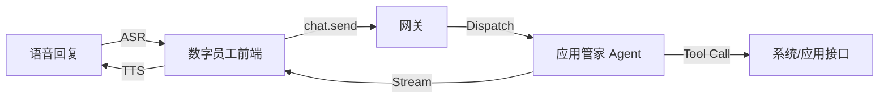

# 数字员工与应用管家 (App Manager) 对接方案

## 1. 背景与目标

为了增强数字员工的能力，使其不仅仅是一个“聊天机器人”，而是能够调用系统功能、管理应用的“系统管家”。
我们将数字员工的后端大脑统一对接给 **应用管家 (App Manager Agent)**。

## 2. 架构设计



### 2.1 核心组件

- **前端 (ChatView)**: 负责语音交互、3D Avatar 展示、VAD 检测。
- **网关 (Gateway)**: 负责消息路由和会话管理。
- **应用管家 (App Manager)**: 一个全能型 Agent，具备调用系统 API、管理其他 Agent 的能力。

## 3. 会话管理 (Session Management)

为了实现“长记忆”和连贯体验，我们不再为每次对话创建新会话，而是绑定到数字员工 ID。

- **Session ID 规则**: `chat-employee-{employeeId}`
  - 例如: `chat-employee-1001`
- **生命周期**:
  - 该 Session ID 在系统中持久存在。
  - 前端每次进入界面，使用此 ID 订阅消息流。
  - 后端负责加载该 ID 对应的历史上下文。

## 4. 接口协议

### 4.1 发送消息 (`chat.send`)

前端在 VAD 检测到说话结束（或收到 ASR Final Result）后，自动调用此接口。

```typescript
// Request
{
  "message": "帮我打开网易云音乐",
  "sessionId": "chat-employee-1001", // 固定 ID
  "mode": "agent",
  "agentId": "app-manager" // 指定对接应用管家，或使用 "default"
}
```

### 4.2 流式回复

后端通过 WebSocket 推送流式消息：

```typescript
// Stream Message
{
  "id": "msg-xyz",
  "role": "assistant",
  "content": "好的，正在为您打开...", // 增量更新
  "final": false
}
```

前端处理逻辑：

1.  **实时字幕**: 监听 `content` 变化，实时更新 UI 字幕。
2.  **TTS 朗读**:
    - 方案 A (简单): 等 `final: true` 后，将完整文本发给 TTS。
    - 方案 B (进阶): 按句切割流式文本，实时发给 TTS (需维护播放队列)。

## 5. 前端交互优化 (已实现)

- **VAD 自动提交**: 用户停止说话 1.2s 后自动发送，无需点击发送。
- **沉浸式 UI**:
  - **视觉**: 3D Avatar + 悬浮全息字幕。
  - **交互**: 底部圆形能量球 (Mic Button) + 径向动态波形 (Radial Visualizer)。
  - **反馈**:
    - Listening: 能量球变大，波形随音量跳动。
    - Thinking: 字幕显示“...”。
    - Speaking: Avatar 嘴型同步 (待接入)，字幕打字机效果。

## 6. 后续规划

1.  **TTS 流式优化**: 降低首字延迟。
2.  **多模态输入**: 允许用户在对话中发送图片（如截屏给数字员工看）。
3.  **Avatar 嘴型同步 (Lip Sync)**: 将 TTS 的 Viseme 数据传给 Live2D/3D 模型，实现精准对口型。
