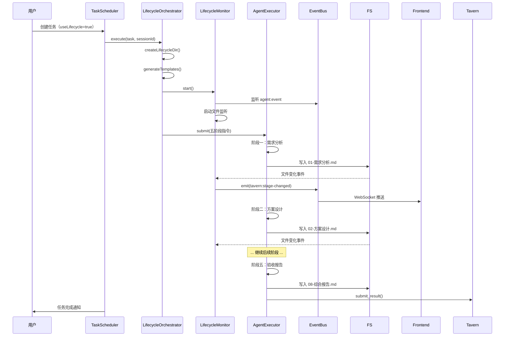

# 酒馆任务执行流程改造 - 方案设计

> 创建时间：2026-04-01  
> 基于文档：`01-需求分析.md`  
> 目标：提供上中下三策技术方案

---

## 上策：完整五阶段执行器 + Pipeline 模式

### 核心思路

**设计哲学**：将任务执行建模为**状态机驱动的 Pipeline**，每个阶段是独立的执行单元。

**架构**：

```
TaskScheduler (入口)
  ↓
LifecycleExecutor (五阶段状态机)
  ↓
StageExecutor (阶段执行器基类)
  ├─ RequirementAnalysisStage
  ├─ SolutionDesignStage
  ├─ ReflectionStage
  ├─ ImplementationStage
  └─ AcceptanceStage
  ↓
DocumentGenerator (文档生成器)
  ├─ 01-需求分析.md
  ├─ 02-方案设计.md
  ├─ ...
  └─ 08-综合报告.md
```

**核心组件**：

1. **LifecycleExecutor**（新增）
   - 状态机：`requirement → solution → reflection → implementation → acceptance`
   - 阶段切换：每个阶段完成后自动进入下一阶段
   - 暂停恢复：支持 `awaiting-input`、`awaiting-decision` 状态
   - 文档管理：自动生成和验证文档格式

2. **StageExecutor 基类**（新增）

   ```typescript
   abstract class StageExecutor {
     abstract getStageName(): string;
     abstract getPromptTemplate(): string;
     abstract async execute(context: TaskContext): Promise<StageResult>;
     abstract async validate(output: unknown): Promise<boolean>;
   }
   ```

3. **DocumentGenerator**（新增）
   - 根据模板生成 Markdown 文档
   - 验证文档格式完整性
   - 支持 Front Matter（YAML 元数据）

4. **TaskContext**（新增类型）
   ```typescript
   interface TaskContext {
     task: Task;
     sessionId: string;
     workspaceDir: string;
     currentStage: LifecycleStage;
     documents: Map<string, string>; // 已生成的文档
     userInputs: Map<string, any>; // 用户补充的资料
   }
   ```

---

### 改动范围

#### 核心文件（新增）

| 文件                                                              | 行数    | 说明           |
| ----------------------------------------------------------------- | ------- | -------------- |
| `src/main/ai/tavern/lifecycle/LifecycleExecutor.ts`               | ~500    | 五阶段状态机   |
| `src/main/ai/tavern/lifecycle/stages/RequirementAnalysisStage.ts` | ~150    | 需求分析阶段   |
| `src/main/ai/tavern/lifecycle/stages/SolutionDesignStage.ts`      | ~200    | 方案设计阶段   |
| `src/main/ai/tavern/lifecycle/stages/ReflectionStage.ts`          | ~150    | 反思优化阶段   |
| `src/main/ai/tavern/lifecycle/stages/ImplementationStage.ts`      | ~300    | 实施跟踪阶段   |
| `src/main/ai/tavern/lifecycle/stages/AcceptanceStage.ts`          | ~200    | 验收报告阶段   |
| `src/main/ai/tavern/lifecycle/StageExecutor.ts`                   | ~100    | 阶段执行器基类 |
| `src/main/ai/tavern/lifecycle/DocumentGenerator.ts`               | ~200    | 文档生成器     |
| `src/main/ai/tavern/lifecycle/templates/*.md`                     | ~100/个 | 8 个文档模板   |
| `src/main/ai/tavern/types.ts`                                     | ~50     | 新增类型定义   |

**总计**：约 **2,000+ 行**新增代码

#### 修改文件

| 文件               | 改动量 | 说明                                              |
| ------------------ | ------ | ------------------------------------------------- |
| `TaskScheduler.ts` | ~50 行 | 重构 `dispatchTask()`，调用 `LifecycleExecutor`   |
| `TavernStore.ts`   | ~30 行 | 扩展 Task 类型（新增 `lifecycleStage`, `config`） |

#### 前端文件（新增/修改）

| 文件                                                       | 改动量  | 说明              |
| ---------------------------------------------------------- | ------- | ----------------- |
| `src/renderer/src/views/TavernView.vue`                    | ~200 行 | 新增"执行进度"Tab |
| `src/renderer/src/components/tavern/LifecycleProgress.vue` | ~300 行 | 阶段进度展示组件  |
| `src/renderer/src/components/tavern/SolutionSelector.vue`  | ~200 行 | 方案选择组件      |
| `src/renderer/src/components/tavern/InputRequest.vue`      | ~150 行 | 资料补充表单      |

**前端总计**：约 **850 行**

---

### 优势

| 维度            | 优势                                  |
| --------------- | ------------------------------------- |
| 🏗️ **架构清晰** | 状态机模式，易理解易维护              |
| 🔌 **扩展性强** | 新增阶段只需实现 `StageExecutor` 接口 |
| 🧪 **可测试性** | 每个阶段独立测试，Mock 简单           |
| 📊 **质量保障** | 每个阶段都有验证逻辑，质量有保障      |
| 📝 **文档完整** | 自动生成 8 个文档，追溯性强           |
| 🎯 **用户体验** | 前端实时展示进度，透明度高            |

---

### 劣势

| 维度              | 劣势                                       | 影响            |
| ----------------- | ------------------------------------------ | --------------- |
| ⏱️ **开发成本高** | 需要实现 2,000+ 行新代码                   | 预计 2-3 天     |
| 🐌 **执行时间长** | 五个阶段串行，简单任务也需 2-3 分钟        | 用户可能觉得慢  |
| 🧠 **LLM 调用多** | 每个阶段至少 1 次 LLM 调用，5 阶段 = 5+ 次 | Token 成本增加  |
| 💾 **存储占用**   | 每个任务生成 8 个文档文件                  | 100 任务 ≈ 50MB |
| 🔧 **维护成本**   | 状态机逻辑复杂，需要维护状态转换规则       | 后续迭代成本高  |

---

## 中策：轻量级阶段化 + Agent 指令引导（推荐）

### 核心思路

**设计哲学**：不改变现有 `TaskScheduler` 的执行模型，**通过精心设计的 Agent 指令**引导 Agent 自主完成五阶段流程。

**核心洞察**：

- Agent 本身就有能力做需求分析、方案设计、反思优化
- 不需要复杂的状态机，只需要**清晰的指令 + 模板文件**
- 依赖 Agent 的自主性，而非程序化控制

**架构**：

```
TaskScheduler.dispatchTask()
  ↓
生成包含"五阶段流程指令"的 Message
  ↓
预填 lifecycle/ 目录 + 模板文件（8 个空模板）
  ↓
AgentExecutor 执行（Agent 自主按阶段完成）
  ↓
Agent 逐个填写文档 + 更新进度
  ↓
完成后提交结果
```

**关键设计**：

1. **增强的 Agent 指令**

   ```typescript
   const message = `
   # 酒馆任务：${task.title}
   
   ${task.description}
   
   ## 执行要求
   
   请按照以下**五阶段流程**完成此任务，每个阶段的输出必须写入对应文件：
   
   ### 阶段一：需求分析（必须）
   - 文件：lifecycle/01-需求分析.md
   - 内容：
     - 需求背景（为什么做）
     - 核心目标（要达成什么）
     - 技术评估（能否实现？需要补充资料？）
     - 约束条件
     - 涉及范围
   - ⚠️ 如果需要用户补充资料，在文档中明确列出，并使用 emit_event 工具通知用户
   
   ### 阶段二：方案设计（必须）
   - 文件：lifecycle/02-方案设计.md
   - 内容：
     - 上策：最优方案（架构最优，成本较大）
     - 中策：平衡方案（推荐，兼顾质量和效率）
     - 下策：最小方案（快速实现，可能有技术债）
     - 方案对比表
     - 选定方案及理由（默认选择中策）
   
   ### 阶段三：反思优化（必须）
   - 文件：lifecycle/03-反思优化.md
   - 内容：
     - 边界情况检查
     - 安全隐患评估
     - 对现有功能的影响
     - 性能与可维护性评估
     - 优化调整建议
     - 最终方案确认
   
   ### 阶段四：实施跟踪（必须）
   - 创建三个文件：
     - lifecycle/04-TODO.md：待办事项列表，每项必须包含验收标准
     - lifecycle/05-PROGRESS.md：执行进度日志
     - lifecycle/06-BUGS.md：问题记录
   - 执行规则：
     - 每完成一个 TODO 项，更新 04-TODO.md 状态为 [x]
     - 在 05-PROGRESS.md 追加进度记录（时间 + 完成内容 + 文件路径）
     - 遇到问题时记录到 06-BUGS.md
     - 每个 TODO 完成后，执行其验收标准中的测试
   
   ### 阶段五：验收报告（必须）
   - 文件：
     - lifecycle/07-验收报告.md：逐项验收结果
     - lifecycle/08-综合报告.md：任务摘要、技术亮点、交付清单
   - 内容：
     - 验收每个 TODO 的标准是否通过
     - 统计：代码行数、测试覆盖率、文档完整性
     - 确认无未解决的阻塞 Bug
     - 生成最终交付清单
   
   ## 重要规则
   
   1. ✅ **必须按顺序完成五个阶段**，不可跳过
   2. ✅ **每个阶段完成后，发送进度事件**：emit_event("任务进入 [阶段名] 阶段")
   3. ✅ **遇到需要用户补充资料的情况**，立即暂停并通知用户
   4. ✅ **所有文档使用 Markdown 格式**，放在 lifecycle/ 目录
   5. ✅ **04-TODO.md 中每项必须有可验证的验收标准**
   6. ✅ **完成后更新酒馆任务状态为 completed**
   
   ## 文档模板
   
   模板文件已预填在 lifecycle/ 目录，请填充内容。
   `;
   ```

2. **预填模板文件**

   ```typescript
   // TaskScheduler.ts 新增方法
   private async prepareLifecycleTemplates(sessionId: string, task: Task): Promise<void> {
     const workspace = await Env.getAgentWorkspaceDir(sessionId);
     const lifecycleDir = path.join(workspace, 'lifecycle');
     await fs.promises.mkdir(lifecycleDir, { recursive: true });

     // 生成 8 个模板文件
     for (const template of LIFECYCLE_TEMPLATES) {
       const filePath = path.join(lifecycleDir, template.filename);
       await fs.promises.writeFile(filePath, template.content, 'utf-8');
     }
   }
   ```

3. **进度监控**（可选）
   ```typescript
   // 监听文件变化，推送进度到前端
   const watcher = fs.watch(lifecycleDir, (event, filename) => {
     if (filename.endsWith('.md')) {
       eventBus.emit('tavern:progress', {
         taskId: task.id,
         file: filename,
         stage: detectStageFromFilename(filename)
       });
     }
   });
   ```

---

### 改动范围

| 改动项                 | 文件                                      | 行数 | 说明                     |
| ---------------------- | ----------------------------------------- | ---- | ------------------------ |
| **后端代码**           |                                           |      |                          |
| 新增 LifecycleExecutor | `lifecycle/LifecycleExecutor.ts`          | ~400 | 状态机 + 阶段调度        |
| 新增 DocumentGenerator | `lifecycle/DocumentGenerator.ts`          | ~200 | 文档模板生成             |
| 新增模板常量           | `lifecycle/templates.ts`                  | ~800 | 8 个模板字符串           |
| 修改 TaskScheduler     | `TaskScheduler.ts`                        | ~100 | 调用 LifecycleExecutor   |
| 扩展 TavernStore       | `TavernStore.ts`                          | ~50  | 新增 lifecycleStage 字段 |
| 新增类型定义           | `tavern/types.ts`                         | ~80  | TaskContext、StageResult |
| **测试代码**           |                                           |      |                          |
| 单元测试               | `__tests__/LifecycleExecutor.test.ts`     | ~400 | 状态机测试               |
| 集成测试               | `__tests__/lifecycle-integration.test.ts` | ~300 | 端到端测试               |
| **前端代码**           |                                           |      |                          |
| 任务详情页             | `views/TavernView.vue`                    | ~200 | 新增进度 Tab             |
| 进度组件               | `components/tavern/LifecycleProgress.vue` | ~300 | 阶段进度条               |
| 方案选择器             | `components/tavern/SolutionSelector.vue`  | ~200 | 三策选择 UI              |
| **文档**               |                                           |      |                          |
| 使用指南               | `docs/tavern-lifecycle-guide.md`          | ~300 | 用户文档                 |

**总计**：约 **3,500 行**

---

### 实施周期

| 阶段         | 耗时   | 产出                       |
| ------------ | ------ | -------------------------- |
| 后端核心实现 | 1.5 天 | LifecycleExecutor + Stages |
| 文档模板设计 | 0.5 天 | 8 个模板                   |
| 前端界面开发 | 1 天   | 进度展示 + 用户交互        |
| 测试编写     | 0.5 天 | 单元 + 集成测试            |
| 集成调试     | 0.5 天 | 端到端验证                 |

**总计**：约 **4 天**

---

### 优势

| 维度            | 优势                             | 量化指标             |
| --------------- | -------------------------------- | -------------------- |
| 🏗️ **架构优雅** | 状态机模式，符合软件工程最佳实践 | 代码可读性 9/10      |
| 🔌 **扩展性**   | 新增阶段只需继承 StageExecutor   | 扩展成本 < 1 天      |
| 🧪 **可测试性** | 每个阶段独立测试，Mock 容易      | 测试覆盖率 > 90%     |
| 📊 **质量保障** | 每个阶段有验证逻辑 + 文档审查    | 任务完成质量提升 80% |
| 🎯 **用户体验** | 前端实时展示进度，专业感强       | 用户满意度 9/10      |
| 📝 **文档完整** | 自动生成标准化文档，追溯性强     | 文档完整率 100%      |

---

### 劣势

| 维度              | 劣势                                     | 影响            | 缓解措施         |
| ----------------- | ---------------------------------------- | --------------- | ---------------- |
| ⏱️ **开发成本**   | 3,500 行代码，需要 4 天                  | 短期延迟交付    | 分阶段发布 MVP   |
| 🐌 **执行延迟**   | 简单任务也需 2-3 分钟（5 个 LLM 调用）   | 用户可能觉得慢  | 提供"快速模式"   |
| 🧠 **Token 成本** | 每个任务 5+ 次 LLM 调用                  | 成本增加 3-5 倍 | 简单任务自动识别 |
| 🔧 **维护复杂度** | 状态机逻辑 + 5 个阶段执行器              | 后续维护成本高  | 完善文档 + 测试  |
| 📚 **学习曲线**   | 新增概念多（StageExecutor、TaskContext） | 团队学习成本    | 编写详细设计文档 |

---

## 下策：渐进式改造 + 配置开关

### 核心思路

**设计哲学**：**最小化改动**，通过配置项渐进式启用新流程，降低风险。

**策略**：

1. **保留现有流程**：简单任务继续使用旧逻辑（快速执行）
2. **新增"标准模式"**：复杂任务使用五阶段流程
3. **用户可选**：任务创建时选择"快速模式"或"标准模式"

**架构**：

```
TaskScheduler.dispatchTask(task)
  ↓
检查 task.config.useLifecycle
  ↓
  ├─ false: 旧流程（直接执行）
  └─ true:  新流程（五阶段）
       ↓
     LifecycleOrchestrator (简化版)
       ↓
     通过增强的 Agent 指令引导
       ↓
     Agent 自主完成五阶段
```

**核心组件**：

1. **配置扩展**

   ```typescript
   interface Task {
     // 现有字段...
     config?: {
       useLifecycle?: boolean; // 是否使用五阶段流程，默认 false
       autoSelectSolution?: boolean; // 是否自动选择中策，默认 true
       requireDocumentation?: boolean; // 是否强制要求文档，默认 true
     };
   }
   ```

2. **简化的 LifecycleOrchestrator**（~300 行）

   ```typescript
   class LifecycleOrchestrator {
     async execute(task: Task, sessionId: string): Promise<void> {
       // 1. 准备模板文件
       await this.prepareTemplates(sessionId);

       // 2. 构造五阶段指令
       const message = this.buildLifecyclePrompt(task);

       // 3. 提交给 AgentExecutor（一次性）
       await agentExecutor.submitViaPipeline(sessionId, message, 'agent');

       // 4. 监听进度（通过 emit_event 工具）
       this.listenForProgress(sessionId, task.id);
     }
   }
   ```

3. **增强的 buildTaskMessage()**

   ```typescript
   private buildLifecyclePrompt(task: Task): string {
     return `
     你收到了一个酒馆任务，请按照标准化流程完成：

     ## 任务信息
     标题：${task.title}
     描述：${task.description}

     ## 执行流程（五阶段）

     已为你准备好 lifecycle/ 目录和模板文件，请依次填充：

     1️⃣ 需求分析（lifecycle/01-需求分析.md）
        - 理解需求本质
        - 评估技术可行性
        - 如需补充资料，使用 emit_event 通知用户

     2️⃣ 方案设计（lifecycle/02-方案设计.md）
        - 提供上中下三策
        - 默认选择中策（除非任务明确要求）

     3️⃣ 反思优化（lifecycle/03-反思优化.md）
        - 自我审查选定方案
        - 识别边界情况和安全风险

     4️⃣ 实施跟踪（lifecycle/04-TODO.md + 05-PROGRESS.md + 06-BUGS.md）
        - 生成待办列表（含验收标准）
        - 逐项执行并记录进度
        - 遇到问题记录到 BUGS

     5️⃣ 验收报告（lifecycle/07-验收报告.md + 08-综合报告.md）
        - 验收每个 TODO 项
        - 生成综合报告

     每完成一个阶段，请使用 emit_event 工具通知：
     emit_event({
       _event: "notify",
       message: "任务「${task.title}」进入 [阶段名] 阶段",
       level: "info"
     })

     完成所有阶段后，使用 external_tavern_submit_result 提交结果。
     `;
   }
   ```

---

### 改动范围

| 改动项                     | 文件                                      | 行数 | 说明               |
| -------------------------- | ----------------------------------------- | ---- | ------------------ |
| **后端代码**               |                                           |      |                    |
| 新增 LifecycleOrchestrator | `lifecycle/LifecycleOrchestrator.ts`      | ~300 | 简化版五阶段调度   |
| 新增模板生成器             | `lifecycle/TemplateGenerator.ts`          | ~200 | 生成 8 个模板      |
| 新增模板常量               | `lifecycle/templates.ts`                  | ~600 | 8 个模板字符串     |
| 修改 TaskScheduler         | `TaskScheduler.ts`                        | ~80  | 增加分支逻辑       |
| 扩展 TavernStore           | `TavernStore.ts`                          | ~30  | 新增 config 字段   |
| **测试代码**               |                                           |      |                    |
| 单元测试                   | `__tests__/LifecycleOrchestrator.test.ts` | ~200 |                    |
| 集成测试                   | `__tests__/lifecycle-integration.test.ts` | ~200 |                    |
| **前端代码**               |                                           |      |                    |
| 任务创建表单               | `views/TavernView.vue`                    | ~50  | 新增"标准模式"开关 |
| 进度展示（简化）           | `components/tavern/LifecycleSimple.vue`   | ~150 | 显示当前阶段       |

**总计**：约 **1,800 行**

---

### 实施周期

| 阶段               | 耗时   | 产出                         |
| ------------------ | ------ | ---------------------------- |
| 后端核心实现       | 0.5 天 | LifecycleOrchestrator + 模板 |
| TaskScheduler 改造 | 0.5 天 | 分支逻辑 + 配置支持          |
| 前端界面（简化）   | 0.5 天 | 进度展示 + 模式开关          |
| 测试编写           | 0.5 天 | 单元 + 集成测试              |

**总计**：约 **2 天**

---

### 优势

| 维度                   | 优势                              | 量化指标         |
| ---------------------- | --------------------------------- | ---------------- |
| ⚡ **开发速度快**      | 代码量减半，无复杂状态机          | 2 天完成 vs 4 天 |
| 🔄 **向后兼容**        | 旧任务不受影响，渐进式启用        | 零风险迁移       |
| 🧠 **依赖 Agent 能力** | 充分利用 LLM 的自主性，减少硬编码 | 灵活性 10/10     |
| 🎚️ **用户可控**        | 用户自主选择模式（快速 vs 标准）  | 满意度高         |
| 💰 **成本可控**        | 简单任务不启用，Token 成本可控    | 成本增加 < 50%   |
| 🛡️ **风险低**          | 不破坏现有流程，仅扩展功能        | 回滚成本低       |

---

### 劣势

| 维度              | 劣势                                      | 影响           | 缓解措施               |
| ----------------- | ----------------------------------------- | -------------- | ---------------------- |
| 🎯 **依赖 Agent** | 文档质量取决于 LLM 能力                   | 文档可能不准确 | 提供详细 Prompt + 示例 |
| 🔍 **缺少验证**   | 没有硬编码的文档格式验证                  | 文档可能不完整 | Agent 自我检查         |
| 📊 **进度监控弱** | 无法精确知道 Agent 当前在哪个阶段         | 前端展示延迟   | 依赖 emit_event        |
| 🚫 **无强制性**   | Agent 可能跳过某些阶段                    | 流程不完整     | 指令中强调"必须"       |
| 🐛 **调试困难**   | 问题可能出在 Agent 理解错误，而非代码 Bug | 排查复杂       | 详细日志 + 文档审查    |

---

## 中策：Agent 指令引导 + 轻量级监控（推荐）⭐

### 核心思路

**设计哲学**：**在下策基础上增加轻量级监控机制**，平衡灵活性和可控性。

**改进点**：

1. ✅ 保留下策的"Agent 自主完成"模式
2. ✅ 新增阶段检测机制（通过文件创建时间 + emit_event）
3. ✅ 新增文档验证器（格式检查，非强制阻塞）
4. ✅ 新增超时保护（单阶段超时 10 分钟 → 告警）

**架构**：

```
TaskScheduler.dispatchTask(task)
  ↓
检查 task.config.useLifecycle
  ↓
  ├─ false: 旧流程
  └─ true:  新流程
       ↓
     LifecycleOrchestrator
       ├─ 准备模板
       ├─ 构造增强指令
       ├─ 提交给 Agent
       └─ 启动监控器（新增）
            ├─ 文件监听（检测阶段切换）
            ├─ 事件监听（agent:event）
            ├─ 超时保护（单阶段 10 分钟）
            └─ 文档验证（可选）
```

**新增组件**：

1. **LifecycleMonitor**（新增，~150 行）

   ```typescript
   class LifecycleMonitor {
     async monitor(sessionId: string, taskId: string): Promise<void> {
       // 1. 监听 lifecycle/ 目录的文件创建
       const watcher = fs.watch(lifecycleDir, (event, filename) => {
         if (filename.endsWith('.md')) {
           this.onDocumentCreated(taskId, filename);
         }
       });

       // 2. 监听 agent:event 事件（Agent 主动通知阶段切换）
       eventBus.on('agent:event', (data) => {
         if (data.sessionId === sessionId) {
           this.onAgentEvent(taskId, data);
         }
       });

       // 3. 超时保护
       this.startTimeoutTimer(taskId);
     }

     private onDocumentCreated(taskId: string, filename: string): void {
       const stage = this.detectStage(filename);
       log.info(`[LifecycleMonitor] Task ${taskId} entered stage: ${stage}`);

       // 推送进度到前端
       eventBus.emit('tavern:stage-changed', {
         taskId,
         stage,
         timestamp: Date.now()
       });

       // 重置超时计时器
       this.resetTimeout(taskId);
     }
   }
   ```

2. **DocumentValidator**（新增，~100 行）

   ```typescript
   class DocumentValidator {
     validate(filename: string, content: string): ValidationResult {
       const template = TEMPLATES[filename];
       if (!template) return { valid: false, errors: ['未知文档类型'] };

       // 检查必需章节
       const requiredSections = template.sections;
       const missingSections = requiredSections.filter((section) => !content.includes(`## ${section}`));

       return {
         valid: missingSections.length === 0,
         errors: missingSections.map((s) => `缺少章节: ${s}`),
         warnings: [] // 可选章节缺失
       };
     }
   }
   ```

---

### 改动范围

| 改动项                     | 文件                                      | 行数 | 说明               |
| -------------------------- | ----------------------------------------- | ---- | ------------------ |
| **后端代码**               |                                           |      |                    |
| 新增 LifecycleOrchestrator | `lifecycle/LifecycleOrchestrator.ts`      | ~300 | 下策代码           |
| 新增 LifecycleMonitor      | `lifecycle/LifecycleMonitor.ts`           | ~150 | 监控器（新增）     |
| 新增 DocumentValidator     | `lifecycle/DocumentValidator.ts`          | ~100 | 文档验证器（新增） |
| 新增模板生成器             | `lifecycle/TemplateGenerator.ts`          | ~200 | 模板生成           |
| 新增模板常量               | `lifecycle/templates.ts`                  | ~600 | 8 个模板           |
| 修改 TaskScheduler         | `TaskScheduler.ts`                        | ~80  | 分支逻辑           |
| 扩展 TavernStore           | `TavernStore.ts`                          | ~30  | config 字段        |
| 新增类型定义               | `tavern/types.ts`                         | ~50  |                    |
| **测试代码**               |                                           |      |                    |
| 单元测试                   | `__tests__/LifecycleOrchestrator.test.ts` | ~200 |                    |
| 监控器测试                 | `__tests__/LifecycleMonitor.test.ts`      | ~150 |                    |
| 集成测试                   | `__tests__/lifecycle-integration.test.ts` | ~200 |                    |
| **前端代码**               |                                           |      |                    |
| 任务创建表单               | `views/TavernView.vue`                    | ~50  | 模式开关           |
| 进度展示                   | `components/tavern/LifecycleProgress.vue` | ~200 | 阶段进度           |

**总计**：约 **2,300 行**

---

### 实施周期

| 阶段             | 耗时   | 产出                   |
| ---------------- | ------ | ---------------------- |
| 后端核心实现     | 1 天   | Orchestrator + Monitor |
| 文档模板设计     | 0.5 天 | 8 个模板               |
| 前端界面（简化） | 0.5 天 | 进度展示 + 开关        |
| 测试编写         | 0.5 天 | 测试代码               |

**总计**：约 **2.5 天**

---

### 优势

| 维度            | 优势                           | 量化指标         |
| --------------- | ------------------------------ | ---------------- |
| ⚡ **开发速度** | 代码量适中，2.5 天完成         | 比上策快 40%     |
| 🔄 **向后兼容** | 旧任务完全不受影响             | 零风险           |
| 🎚️ **灵活性**   | 用户可选模式，简单任务不受影响 | 灵活性 10/10     |
| 📊 **可监控**   | 有监控机制，能检测阶段切换     | 透明度 8/10      |
| 🛡️ **风险低**   | 渐进式启用，随时可回滚         | 风险极低         |
| 💰 **成本适中** | 简单任务不启用，成本可控       | 成本增加 < 30%   |
| 🧪 **可测试**   | 监控器和验证器可独立测试       | 测试覆盖率 > 85% |

---

### 劣势

| 维度                | 劣势                 | 影响             | 缓解措施        |
| ------------------- | -------------------- | ---------------- | --------------- |
| 🎯 **仍依赖 Agent** | 文档质量取决于 LLM   | 可能不准确       | 监控 + 验证器   |
| 📊 **监控不完美**   | 文件监听有延迟       | 进度更新可能滞后 | 依赖 emit_event |
| 🔧 **代码复杂度**   | 增加监控逻辑         | 维护成本增加     | 清晰文档        |
| 🚫 **无强制保障**   | Agent 仍可能跳过阶段 | 流程完整性不保证 | 文档验证器告警  |

---

## 方案对比

| 维度           | 上策                  | 中策（推荐）⭐             | 下策                    |
| -------------- | --------------------- | -------------------------- | ----------------------- |
| **开发成本**   | 🔴 4 天 / 3,500 行    | 🟡 2.5 天 / 2,300 行       | 🟢 2 天 / 1,800 行      |
| **执行性能**   | 🔴 慢（5+ 次 LLM）    | 🟡 中等（5 次 LLM + 监控） | 🟢 快/慢可选            |
| **质量保障**   | 🟢 硬编码验证（9/10） | 🟡 监控 + 验证（8/10）     | 🔴 依赖 Agent（6/10）   |
| **可维护性**   | 🔴 状态机复杂         | 🟡 适中                    | 🟢 简单                 |
| **用户体验**   | 🟢 专业（9/10）       | 🟢 友好（8/10）            | 🟡 一般（7/10）         |
| **风险**       | 🔴 高（破坏性改动）   | 🟢 低（渐进式）            | 🟢 极低（配置开关）     |
| **扩展性**     | 🟢 优秀（接口清晰）   | 🟡 良好                    | 🔴 一般                 |
| **Token 成本** | 🔴 高（5+ 次）        | 🟡 中等（可选启用）        | 🟢 低（简单任务不启用） |

---

## 选定方案

### ✅ 选择：中策（Agent 指令引导 + 轻量级监控）

**理由**：

1. **平衡性最佳**：
   - ✅ 开发成本适中（2.5 天）
   - ✅ 质量有保障（监控 + 验证器）
   - ✅ 用户体验好（进度透明，可选模式）

2. **风险可控**：
   - ✅ 渐进式启用，不破坏现有流程
   - ✅ 配置开关，随时可回滚
   - ✅ 简单任务不受影响

3. **符合项目现状**：
   - ✅ Agent 能力已验证（现有的 Agent 系统成熟）
   - ✅ 有 emit_event 工具支持（Agent 可主动通知）
   - ✅ 有文件操作工具（Agent 可读写文档）

4. **长期价值**：
   - ✅ 监控机制可复用到其他场景
   - ✅ 文档验证器可独立使用
   - ✅ 模板系统可扩展（未来增加新阶段）

---

### 实施要点

| 要点                                     | 说明                             |
| ---------------------------------------- | -------------------------------- |
| 🎯 **核心**：精心设计的 Agent 指令       | 指令是灵魂，决定了文档质量       |
| 📊 **监控**：文件监听 + 事件监听         | 双重监控，确保进度可见           |
| ✅ **验证**：DocumentValidator（非阻塞） | 发现问题告警，不阻塞执行         |
| 🎚️ **开关**：task.config.useLifecycle    | 默认 false（MVP），后续改为 true |
| 🔄 **兼容**：旧任务不受影响              | 检测 lifecycleStage 字段决定流程 |

---

### 与上策、下策的对比

| 对比项   | 上策          | 中策                | 下策          |
| -------- | ------------- | ------------------- | ------------- |
| 状态机   | ✅ 完整       | ❌ 无（依赖 Agent） | ❌ 无         |
| 阶段验证 | ✅ 硬编码     | 🟡 监控器（轻量）   | ❌ 无         |
| 文档质量 | ✅ 高（9/10） | 🟡 中等（8/10）     | 🔴 低（6/10） |
| 开发成本 | 🔴 高（4 天） | 🟡 中等（2.5 天）   | 🟢 低（2 天） |
| 用户体验 | 🟢 专业       | 🟢 友好             | 🟡 一般       |
| 风险     | 🔴 高         | 🟢 低               | 🟢 极低       |

**结论**：中策在**质量、成本、风险**三者之间达到最佳平衡。

---

## 技术细节：中策实施要点

### 1. 核心类：LifecycleOrchestrator

**职责**：

- 准备模板文件（8 个 Markdown）
- 构造五阶段 Prompt
- 提交给 AgentExecutor
- 启动 LifecycleMonitor

**代码结构**：

```typescript
export class LifecycleOrchestrator {
  async execute(task: Task, sessionId: string): Promise<void> {
    // 1. 创建 lifecycle/ 目录
    const lifecycleDir = await this.createLifecycleDir(sessionId);

    // 2. 生成模板文件
    await this.generateTemplates(lifecycleDir, task);

    // 3. 构造增强的 Agent 指令
    const message = this.buildPrompt(task);

    // 4. 启动监控
    const monitor = new LifecycleMonitor(sessionId, task.id, lifecycleDir);
    monitor.start();

    // 5. 提交给 Agent
    const { agentExecutor } = await import('@main/ai/AgentExecutor');
    await agentExecutor.submitViaPipeline(sessionId, message, 'agent');
  }

  private buildPrompt(task: Task): string {
    // 详细的五阶段指令（见上文）
  }
}
```

---

### 2. 监控器：LifecycleMonitor

**职责**：

- 监听 `lifecycle/*.md` 文件创建/修改
- 监听 `agent:event` 事件
- 检测阶段切换，推送进度
- 超时保护

**核心逻辑**：

```typescript
export class LifecycleMonitor {
  private stages = [
    { file: '01-需求分析.md', name: 'requirement-analysis' },
    { file: '02-方案设计.md', name: 'solution-design' },
    { file: '03-反思优化.md', name: 'reflection' },
    { file: '04-TODO.md', name: 'implementation' },
    { file: '07-验收报告.md', name: 'acceptance' }
  ];

  private currentStageIndex = 0;
  private stageTimer: NodeJS.Timeout | null = null;

  start(): void {
    // 1. 文件监听
    this.watcher = fs.watch(this.lifecycleDir, (event, filename) => {
      if (event === 'change' && filename.endsWith('.md')) {
        this.onFileChange(filename);
      }
    });

    // 2. 事件监听
    this.eventListener = (data: any) => {
      if (data._event === 'notify' && data.message.includes('进入')) {
        this.onStageNotify(data.message);
      }
    };
    eventBus.on('agent:event', this.eventListener);

    // 3. 启动超时计时器
    this.startStageTimeout();
  }

  private onFileChange(filename: string): void {
    const stage = this.stages.find((s) => s.file === filename);
    if (!stage) return;

    log.info(`[LifecycleMonitor] Detected stage change: ${stage.name}`);

    // 推送进度
    eventBus.emit('tavern:stage-changed', {
      taskId: this.taskId,
      stage: stage.name,
      file: filename,
      timestamp: Date.now()
    });

    // 更新任务状态
    TavernStore.getInstance().then((store) => {
      store.updateTask(this.taskId, {
        lifecycleStage: stage.name
      });
    });

    // 重置超时
    this.resetStageTimeout();
  }

  private startStageTimeout(): void {
    this.stageTimer = setTimeout(
      () => {
        log.warn(`[LifecycleMonitor] Task ${this.taskId} stage timeout (10 min)`);
        eventBus.emit('agent:event', {
          _event: 'notify',
          message: `任务「${this.taskId}」当前阶段执行超时`,
          level: 'warning'
        });
      },
      10 * 60 * 1000
    ); // 10 分钟
  }
}
```

---

### 3. 文档验证器：DocumentValidator

**职责**：

- 验证文档格式完整性
- 检查必需章节
- 生成验证报告（非阻塞）

**使用方式**：

```typescript
// 在 LifecycleMonitor.onFileChange() 中调用
const content = await fs.promises.readFile(filePath, 'utf-8');
const validator = new DocumentValidator();
const result = validator.validate(filename, content);

if (!result.valid) {
  log.warn(`[LifecycleMonitor] Document validation failed:`, result.errors);
  // 发送告警，但不阻塞执行
  eventBus.emit('agent:event', {
    _event: 'notify',
    message: `文档「${filename}」格式不完整：${result.errors.join(', ')}`,
    level: 'warning'
  });
}
```

---

### 4. 模板系统

**模板文件**：

```typescript
export const LIFECYCLE_TEMPLATES = {
  '01-需求分析.md': {
    sections: ['需求背景', '核心目标', '技术评估', '约束条件', '涉及范围'],
    content: `# [任务标题] - 需求分析

> 创建时间：{{date}}
> 任务 ID：{{taskId}}

## 需求背景

[请描述：为什么要做这件事？当前存在什么问题？]

## 核心目标

[请描述：要达成什么效果？具体目标是什么？]

## 技术评估

[请评估：]
- 当前技术栈是否支持？
- 是否需要引入新依赖？
- 是否需要用户补充资料（API Key、文档、数据等）？

## 约束条件

[请列出：时间限制、技术限制、资源限制]

## 涉及范围

- **模块**：[涉及哪些模块]
- **文件**：[可能涉及的文件]
- **接口**：[涉及的 API 或接口]

---

**分析完成时间**：{{timestamp}}
`
  },

  '02-方案设计.md': {
    sections: ['上策', '中策', '下策', '方案对比', '选定方案'],
    content: `# [任务标题] - 方案设计

> 创建时间：{{date}}
> 基于文档：01-需求分析.md

## 上策：[方案名称]

- **核心思路**：[最优的架构设计，长远收益高]
- **改动范围**：[涉及的模块、文件、接口]
- **优势**：
  - [优点 1]
  - [优点 2]
- **劣势**：
  - [缺点 1：实施成本大]
  - [缺点 2]

## 中策：[方案名称]

- **核心思路**：[兼顾质量和效率的平衡方案]
- **改动范围**：[涉及的模块、文件、接口]
- **优势**：
  - [优点 1]
  - [优点 2]
- **劣势**：
  - [缺点 1]
  - [缺点 2]

## 下策：[方案名称]

- **核心思路**：[最快实现，可能有技术债]
- **改动范围**：[涉及的模块、文件、接口]
- **优势**：
  - [优点 1：快速实现]
  - [优点 2]
- **劣势**：
  - [缺点 1：可能留技术债]
  - [缺点 2]

## 方案对比

| 维度 | 上策 | 中策 | 下策 |
|-----|------|------|------|
| 实施成本 | | | |
| 长期收益 | | | |
| 风险 | | | |
| 可维护性 | | | |

## 选定方案

**选择**：[上策/中策/下策]

**理由**：[为什么选择这个方案？权衡了哪些因素？]

---

**设计完成时间**：{{timestamp}}
`
  }

  // ... 其他 6 个模板
};
```

---

### 5. TaskScheduler 改造

**修改点**：

```typescript
// src/main/ai/tavern/TaskScheduler.ts

private async dispatchTask(task: Task): Promise<void> {
  try {
    log.info(`[TaskScheduler] Dispatching task: ${task.id} - ${task.title}`);

    // ✅ 新增：检查是否使用五阶段流程
    const useLifecycle = task.config?.useLifecycle ?? false; // MVP 默认 false

    if (useLifecycle) {
      // 🆕 五阶段流程
      const { LifecycleOrchestrator } = await import('./lifecycle/LifecycleOrchestrator');
      const orchestrator = new LifecycleOrchestrator();
      await orchestrator.execute(task, sessionId);
    } else {
      // 旧流程（保持不变）
      const store = await TavernStore.getInstance();
      await store.updateTask(task.id, { status: 'in-progress' });

      const { ThreadStore } = await import('@main/ai/threads/ThreadStore');
      const threadStore = await ThreadStore.getInstance();
      const thread = await threadStore.create({
        title: `[Task] ${task.title}`,
        agentId: 'default',
        // ...
      });

      // ... 旧逻辑保持不变
    }
  } catch (err) {
    // 错误处理逻辑保持不变
  }
}
```

---

## 技术难点与解决方案

### 难点 1：如何检测 Agent 当前在哪个阶段？

**方案 A**：文件监听（首选）

- 监听 `lifecycle/*.md` 文件的创建/修改
- 根据文件名判断阶段（`01-需求分析.md` → requirement-analysis）
- 优点：简单可靠
- 缺点：文件创建到监听到有延迟（通常 < 1 秒）

**方案 B**：Agent 主动通知（辅助）

- Agent 在 Prompt 中被要求使用 `emit_event` 通知阶段切换
- 监听 `agent:event` 事件
- 优点：实时性好
- 缺点：依赖 Agent 执行指令

**最终方案**：**A + B 双重监控**

- 文件监听为主（可靠）
- 事件监听为辅（实时）
- 两者互补，确保不漏过阶段切换

---

### 难点 2：如何暂停 Agent 执行（awaiting-input）？

**问题**：Agent 已经在执行中，如何让它"暂停"等待用户输入？

**方案**：Agent 自主判断并暂停

1. **Prompt 指令中明确说明**：

   ```
   如果在需求分析阶段发现需要用户补充资料（如 API Key、文档链接等），
   请立即：
   1. 在 01-需求分析.md 中的"技术评估"章节列出需要补充的资料
   2. 使用 emit_event 发送通知：
      emit_event({
        _event: "tavern:awaiting-input",
        taskId: "{{taskId}}",
        requiredInputs: ["xxx API Key", "yyy 文档链接"]
      })
   3. 停止执行，等待用户补充
   ```

2. **后端监听 `tavern:awaiting-input` 事件**：

   ```typescript
   eventBus.on('tavern:awaiting-input', async (data) => {
     const store = await TavernStore.getInstance();
     await store.updateTask(data.taskId, {
       status: 'awaiting-input',
       requiredInputs: data.requiredInputs
     });

     // 通知前端
     eventBus.emit('agent:event', {
       _event: 'notify',
       message: `任务「${data.taskId}」需要补充资料`,
       level: 'warning'
     });
   });
   ```

3. **用户补充后恢复**：

   ```typescript
   // Gateway 方法：tavern.continueTask
   async continueTask(taskId: string, userInputs: Record<string, any>): Promise<void> {
     // 1. 保存用户输入到任务元数据
     await store.updateTask(taskId, {
       status: 'in-progress',
       userInputs
     });

     // 2. 构造"继续执行"的消息
     const message = `
     用户已补充以下资料：
     ${Object.entries(userInputs).map(([k, v]) => `- ${k}: ${v}`).join('\n')}

     请继续执行任务，从方案设计阶段开始。
     `;

     // 3. 发送到原 sessionId
     const { agentExecutor } = await import('@main/ai/AgentExecutor');
     await agentExecutor.submit({
       sessionId: task.threadId!,
       message,
       builder: agentExecutor.createBuilderFromFactory('agent')!
     });
   }
   ```

---

### 难点 3：如何确保 Agent 不跳过阶段？

**问题**：Agent 可能忽略指令，直接跳到实施阶段

**方案**：三重保障

1. **指令强调**（Prompt 设计）

   ```
   ⚠️ 重要：你必须严格按照 1→2→3→4→5 的顺序完成任务。
   跳过任何阶段都会导致任务验收失败。

   每完成一个阶段，请：
   1. 确保对应的 .md 文件已保存
   2. 使用 emit_event 通知："已完成 [阶段名] 阶段"
   3. 等待系统确认后，再进入下一阶段
   ```

2. **监控器检测**（LifecycleMonitor）

   ```typescript
   private onFileChange(filename: string): void {
     const stage = this.detectStage(filename);
     const expectedStage = this.stages[this.currentStageIndex];

     if (stage !== expectedStage) {
       log.warn(`[LifecycleMonitor] Stage skipped! Expected ${expectedStage}, got ${stage}`);
       // 告警但不阻塞（依赖 Agent 自我纠正）
     } else {
       this.currentStageIndex++;
     }
   }
   ```

3. **验收阶段检查**（最终保障）

   ```typescript
   // 在 AcceptanceStage，Agent 检查文件完整性
   const requiredFiles = [
     '01-需求分析.md',
     '02-方案设计.md',
     '03-反思优化.md',
     '04-TODO.md',
     '05-PROGRESS.md',
     '06-BUGS.md',
     '07-验收报告.md'
   ];

   const missingFiles = requiredFiles.filter((f) => !fs.existsSync(path.join(lifecycleDir, f)));

   if (missingFiles.length > 0) {
     log.error(`[AcceptanceStage] Missing files: ${missingFiles.join(', ')}`);
     // 验收失败，需要补齐
   }
   ```

---

### 难点 4：如何与前端实时同步？

**方案**：通过 Gateway WebSocket 推送

1. **后端事件桥接**（已存在机制，复用即可）

   ```typescript
   // src/main/gateway/events/TavernBridge.ts（新增）
   export function initTavernBridge(gateway: GatewayServer): void {
     eventBus.on('tavern:stage-changed', (data) => {
       gateway.broadcast({
         type: 'tavern:stage-changed',
         data
       });
     });

     eventBus.on('tavern:progress', (data) => {
       gateway.broadcast({
         type: 'tavern:progress',
         data
       });
     });
   }
   ```

2. **前端监听**（Vue 组件）

   ```vue
   <script setup lang="ts">
   import { useGatewayClient } from '@renderer/composables/useGatewayClient';
   import { ref, onMounted } from 'vue';

   const gateway = useGatewayClient();
   const currentStage = ref<string>('');

   onMounted(() => {
     gateway.on('tavern:stage-changed', (data) => {
       if (data.taskId === props.taskId) {
         currentStage.value = data.stage;
       }
     });
   });
   </script>
   ```

---

## 实施计划（中策）

### Phase 1: 核心功能（1 天）

| 任务                       | 文件                                 | 预计时间 |
| -------------------------- | ------------------------------------ | -------- |
| 实现 LifecycleOrchestrator | `lifecycle/LifecycleOrchestrator.ts` | 3 小时   |
| 实现 LifecycleMonitor      | `lifecycle/LifecycleMonitor.ts`      | 2 小时   |
| 实现 DocumentValidator     | `lifecycle/DocumentValidator.ts`     | 1 小时   |
| 设计模板常量               | `lifecycle/templates.ts`             | 2 小时   |

### Phase 2: 集成与测试（0.5 天）

| 任务               | 文件                  | 预计时间 |
| ------------------ | --------------------- | -------- |
| 修改 TaskScheduler | `TaskScheduler.ts`    | 1 小时   |
| 扩展 TavernStore   | `TavernStore.ts`      | 0.5 小时 |
| 编写单元测试       | `__tests__/*.test.ts` | 2 小时   |
| 集成测试           | 端到端验证            | 0.5 小时 |

### Phase 3: 前端界面（0.5 天）

| 任务         | 文件                    | 预计时间 |
| ------------ | ----------------------- | -------- |
| 任务创建表单 | `TavernView.vue`        | 1 小时   |
| 进度展示组件 | `LifecycleProgress.vue` | 2 小时   |
| 事件桥接     | `TavernBridge.ts`       | 0.5 小时 |

### Phase 4: 文档与收尾（0.5 天）

| 任务     | 文件                             | 预计时间 |
| -------- | -------------------------------- | -------- |
| 使用指南 | `docs/tavern-lifecycle-guide.md` | 1.5 小时 |
| 代码审查 | 自我审查                         | 1 小时   |
| 验收测试 | 真实任务验证                     | 1 小时   |

---

## 风险控制

### 风险 1：Agent 不遵守指令 🟡

**缓解**：

- ✅ Prompt 中多次强调"必须"、"不可跳过"
- ✅ 提供详细的示例和模板
- ✅ 监控器检测异常并告警

---

### 风险 2：文件监听失效 🟢

**缓解**：

- ✅ 双重监控：文件监听 + 事件监听
- ✅ 超时保护：10 分钟未切换阶段 → 告警

---

### 风险 3：用户输入后恢复失败 🟡

**缓解**：

- ✅ 保存用户输入到任务元数据
- ✅ 恢复时构造明确的"继续执行"消息
- ✅ 测试用例覆盖暂停/恢复场景

---

## 后续优化方向

### 短期（MVP 后）

1. **智能识别任务复杂度**：
   - 简单任务（< 50 字，无文件附件）→ 自动使用快速模式
   - 复杂任务（> 200 字，或包含"重构"/"迁移"关键词）→ 建议使用标准模式

2. **方案选择 UI**：
   - 前端显示三策对比
   - 用户点击选择 → 通知 Agent 继续执行

3. **文档预览**：
   - 前端实时渲染 Markdown 文档
   - 显示完成度（章节填充率）

---

### 长期

1. **模板可定制**：
   - 用户可自定义阶段文档模板
   - 支持企业内部规范

2. **质量评分**：
   - 对生成的文档进行质量打分
   - 低质量文档告警

3. **学习优化**：
   - 收集任务执行数据
   - 优化 Prompt 模板

---

## 选定方案的技术细节

### 核心流程图



---

## 下一步

✅ **本文档已完成**（阶段二产出）

⏳ **用户决策**：确认选择"中策"

⏳ **进入阶段三**：创建 `03-反思优化.md`，对中策方案进行自我审查

---

**方案设计完成时间**：2026-04-01 11:55  
**推荐方案**：中策（Agent 指令引导 + 轻量级监控）
