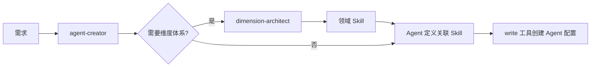

# Agent 创建指南（Agent Creator）

## 核心职责

将**用户需求或任务特征**转化为**可执行的 Agent 定义**，使用现有工具组合完成持久化（创建配置文件）。

**核心原则**：

1. 通过 **现有工具组合** 完成 Agent 创建，避免工具膨胀
2. **先确认核心信息**（名称、任务、模型），再进行详细规划
3. 结构化提问，避免盲目猜测用户意图

## 何时创建 Agent

### 用户主动请求

- "帮我创建一个代码审查助手"
- "我需要一个专门做翻译的 Agent"
- "做一个合同审查的专家"

**处理方式**：

1. **不要立即开始创建**
2. **先通过问题清单（Step 0）收集核心信息**
3. 即使用户请求很明确，也要确认名称、任务和模型
4. 确认完成后，再进行详细规划

### LLM 自主判断（更重要）

当你在处理任务时，如果发现：

- **重复性专业任务**：同类任务会反复出现（如批量审查、定期报告）
- **领域知识密集**：需要深度专业知识（如法律、医学、财务）
- **工具集合固定**：某类任务总是用同一组工具
- **指令模式固定**：每次都需要类似的行为约束

→ 你应该**主动提议创建**一个专业 Agent，并引导用户通过问题清单确认核心信息。

## 创建流程（7 步）

```
需求/任务特征 → ⓪ 确认核心信息 → ① 意图分析 → ② 能力规划 → ③ 定义生成 → ④ 检查重复 → ⑤ 写入文件 → ⑥ 验证
```

**使用工具**：`glob`（检查）, `read`（读取）, `write`（创建）, `exec`（验证）

### Step 0：确认核心信息（必需）

**当用户意图是创建 Agent 时，必须先通过问题清单收集核心信息。**

向用户提出以下 3 个问题：

#### 问题清单

1. **Agent 名称**
   - 问题："这个 Agent 叫什么名字？请提供一个简短的中文名称。"
   - 示例：代码审查专家、文档摘要助手、OCR 识别助手
   - 备注：名称应该简洁明了，体现 Agent 的核心功能

2. **核心任务**
   - 问题："这个 Agent 主要用来完成什么任务？请简要描述。"
   - 示例：
     - 审查代码质量，发现潜在问题
     - 将长文档提取关键信息并生成摘要
     - 识别图像中的文字并结构化输出
   - 备注：任务描述应该清晰具体，包含输入和输出

3. **模型选择**
   - 问题："这个 Agent 需要使用什么模型？（可选，不确定可以跳过，我会根据任务特征推荐）"
   - 快速参考：
     - 代码任务 → `deepseek/deepseek-v3`
     - 推理任务 → `dashscope/qwen3.5-plus`
     - 视觉任务 → `dashscope/qwen-vl-plus`
     - 快速响应 → `dashscope/qwen-turbo-latest`
     - 不确定 → 留空，让我根据任务推荐
   - 备注：可以引用 `model-config` Skill 获取完整模型列表

#### 提问方式

**方式 1：结构化提问（推荐）**

```markdown
为了创建一个合适的 Agent，我需要确认以下信息：

1. **Agent 名称**：这个 Agent 叫什么名字？（例如：代码审查专家）

2. **核心任务**：这个 Agent 主要用来完成什么任务？请简要描述。
   （例如：审查代码质量，发现潜在问题并提供改进建议）

3. **模型选择**（可选）：需要使用特定模型吗？
   - 代码任务 → deepseek/deepseek-v3
   - 推理任务 → dashscope/qwen3.5-plus
   - 视觉任务 → dashscope/qwen-vl-plus
   - 不确定 → 跳过，我会根据任务推荐

请回答这 3 个问题，我会为你创建一个专业的 Agent。
```

**方式 2：逐步确认（复杂场景）**

如果用户需求模糊，可以分步骤确认：

1. 先问核心任务
2. 根据任务推测名称，让用户确认或修改
3. 根据任务特征推荐模型，让用户确认

#### 收集信息后

确认收到用户回答后，进入 **Step 1：意图分析**。

---

### Step 1：意图分析

基于 Step 0 收集的信息，深入分析并补充细节：

| 要素       | 说明                  | 示例                       | 来源         |
| ---------- | --------------------- | -------------------------- | ------------ |
| 核心任务   | 这个 Agent 主要做什么 | 审查代码质量               | Step 0 问题2 |
| Agent 名称 | Agent 的显示名称      | 代码审查专家               | Step 0 问题1 |
| 模型选择   | 使用的模型配置        | deepseek/deepseek-v3       | Step 0 问题3 |
| 适用场景   | 什么时候需要它        | 代码提交前的质量把关       | 推断         |
| 目标用户   | 谁会使用它            | 开发者、Tech Lead          | 推断         |
| 输入/输出  | 接收什么、产出什么    | 输入代码文件，输出审查报告 | 推断         |
| 领域       | 所属专业领域          | 软件工程                   | 推断         |

**原则**：

- 优先使用 Step 0 收集的信息
- 补充推断的信息（适用场景、目标用户等）
- 如有关键信息缺失，可以再次向用户确认（但要简洁）

### Step 2：能力规划

基于意图分析，规划 Agent 的能力配置：

#### 2.1 工具选择

从可用工具中选择（只选需要的，不贪多）：

| 工具           | 用途         | 适合场景                     |
| -------------- | ------------ | ---------------------------- |
| `read`         | 读取文件     | 几乎所有 Agent 都需要        |
| `write`        | 写文件       | 需要输出报告/结果的 Agent    |
| `edit`         | 编辑文件     | 需要修改代码/文档的 Agent    |
| `exec`         | 执行命令     | 需要运行脚本/测试的 Agent    |
| `search`       | 搜索文件内容 | 需要查找代码/文本的 Agent    |
| `glob`         | 搜索文件名   | 需要发现文件的 Agent         |
| `memory`       | 记忆管理     | 需要记住经验/偏好的 Agent    |
| `manage_agent` | 管理 Agent   | 元 Agent（可创建其他 Agent） |

**原则**：

- 纯对话 Agent（翻译、问答）→ 可以不需要工具
- 分析型 Agent → `read` + `search` + `glob`
- 执行型 Agent → `read` + `write` + `edit` + `exec`
- 全能型 Agent → 不指定 tools（继承全部）

#### 2.2 Skill 关联

检查是否有现成的 Skill 可以增强 Agent：

- 先用 `skill_list` 工具查看可用 Skill
- 如果 Agent 需要维度化的评估能力 → 考虑先用 `dimension-architect` 创建领域 Skill
- 如果 Agent 的领域已有对应 Skill → 直接关联

#### 2.3 模型配置

为 Agent 选择合适的模型配置（主模型 + 备选模型）。

**使用 `model-config` Skill**：

这是一个专门的 Skill，帮助你根据任务特征选择最优模型配置。它会：

1. 通过安全的脚本获取最新的可用模型列表
2. 根据任务类型（代码/推理/视觉等）推荐最优模型
3. 设计合理的 fallback 策略

**何时配置模型**：

| 场景           | 是否需要配置 | 说明                     |
| -------------- | ------------ | ------------------------ |
| 通用对话 Agent | ❌ 否        | 使用全局默认模型即可     |
| 代码生成 Agent | ✅ 是        | 需要代码能力强的模型     |
| 视觉理解 Agent | ✅ 是        | 需要支持 Vision 的模型   |
| 复杂推理 Agent | ✅ 是        | 需要推理能力强的模型     |
| 快速响应 Agent | ✅ 是        | 需要速度快、成本低的模型 |

**配置格式**：

```json5
{
  // 方式 1：简单字符串（单一模型，无备选）
  model: 'provider/model',

  // 方式 2：完整配置（推荐，支持备选）
  modelConfig: {
    primary: 'provider/model', // 主模型
    fallbacks: [
      // 备选模型列表
      'provider/model2',
      'provider/model3'
    ]
  }
}
```

**快速参考**：

- 代码生成 → `deepseek/deepseek-v3`
- 推理任务 → `dashscope/qwen3.5-plus`
- 视觉理解 → `dashscope/qwen-vl-plus`
- 快速响应 → `dashscope/qwen-turbo-latest`

**详细指导**：阅读 `model-config` Skill 获取完整的选择策略和管理方法。

#### 2.4 指令设计

系统指令（instructions）是 Agent 的灵魂。好的指令包含：

```
1. 角色定位  — 你是谁，擅长什么
2. 行为规范  — 如何工作，什么原则
3. 输出格式  — 结果长什么样
4. 约束边界  — 什么不做，什么要谨慎
```

**指令编写最佳实践**：

- 用中文编写（本系统的主要语言）
- 开头一句话定义角色："你是一个专业的{领域}{角色}..."
- 明确列出工作步骤（1、2、3...）
- 明确输出格式（Markdown 表格、清单、报告模板）
- 设定边界："如果遇到{情况}，你应该{动作}"

**指令编写反模式**：

- 太短太模糊："你是一个好助手"（无指导价值）
- 太长太啰嗦：超过 2000 字（LLM 注意力衰减）
- 与工具不匹配：指令说"运行测试"但没给 exec 工具
- 缺少输出格式：Agent 每次输出风格不一致

### Step 3：定义生成

将 Step 1-2 的分析结果组装为 Agent 配置对象：

```json5
{
  id: 'code-reviewer', // kebab-case
  name: '代码审查专家', // 中文显示名
  description: '审查代码质量...', // 一句话，用于匹配和展示
  instructions: '你是一个专业的...', // Step 2.4 的产出
  tools: ['read', 'search', 'glob'], // Step 2.1 的选择
  skills: ['coding-standards'], // Step 2.2 的关联

  // 模型配置（Step 2.3 的产出）
  modelConfig: {
    primary: 'deepseek/deepseek-v3', // 主模型
    fallbacks: [
      // 备选模型
      'dashscope/qwen-coder-plus',
      'dashscope/qwen3.5-plus'
    ]
  },

  thinkingLevel: 'medium', // 思考深度
  createdBy: 'agent', // 或 "user"
  createdAt: '2026-02-22T10:00:00Z', // ISO 时间戳
  version: 1
}
```

**注意**：

- 如果是通用 Agent，可以省略 `modelConfig`，使用全局默认
- 也可以使用简化格式 `"model": "provider/model"`（不支持 fallback）

**ID 命名规范**：

- 使用 kebab-case（小写字母 + 连字符）
- 简短且有意义：`code-reviewer`、`contract-analyst`、`translator`
- 避免前缀/后缀冗余：不用 `agent-code-reviewer` 或 `code-reviewer-agent`

### Step 4：检查重复

使用 `glob` 工具检查 Agent 是否已存在：

```typescript
// 工具：glob
glob({ pattern: 'agents/*.json' });
// 结果：['agents/code-reviewer.json', 'agents/translator.json', ...]

// 如果发现同名 Agent，询问用户：
// 1. 覆盖现有 Agent
// 2. 使用不同的 ID
// 3. 取消创建
```

### Step 5：写入文件

使用 `write` 工具创建 Agent 配置文件：

**工具：write**

```typescript
write({
  path: 'agents/{agentId}.json',
  content: JSON.stringify(
    {
      id: 'code-reviewer',
      name: '代码审查专家',
      description: '审查代码质量、安全性和可维护性，输出结构化审查报告',
      instructions: '你是一个资深的代码审查专家...',
      tools: ['read', 'search', 'glob', 'write'],
      skills: [],
      model: null,
      thinkingLevel: 'medium',
      createdBy: 'agent',
      createdAt: new Date().toISOString(),
      version: 1
    },
    null,
    2
  )
});
```

**文件位置**：

- 工作空间 Agent：`{workspace}/agents/{agentId}.json`
- 用户 Agent：`{userDataDir}/agents/{agentId}.json`

**优先使用工作空间**（除非用户明确要求全局可用）。

### Step 6：验证

使用 `read` 工具验证文件已正确创建：

```typescript
// 工具：read
read({ path: 'agents/{agentId}.json' });

// 验证 JSON 格式是否正确
// 验证必需字段是否存在（id, name, description, instructions）
```

创建成功后，告知用户：

- ✅ Agent 已创建
- 📁 位置：`agents/{agentId}.json`
- 🎯 Agent 的能力概述
- 💡 如何使用（通过 `delegate_to_agent` 工具委托，或系统自动发现）

## 更新已有 Agent

如果用户反馈某个 Agent 表现不好，或需要调整能力：

1. 使用 `read` 工具读取现有配置：`read({ path: 'agents/{agentId}.json' })`
2. 分析需要调整的部分（instructions, tools, skills 等）
3. 修改配置对象，版本号 +1
4. 使用 `write` 工具覆盖文件
5. 验证更新是否成功

**示例**：

```typescript
// 1. 读取现有配置
const config = JSON.parse(read({ path: 'agents/code-reviewer.json' }));

// 2. 修改配置
config.instructions = '更新后的指令...';
config.tools.push('exec'); // 添加新工具
config.version += 1; // 版本号递增
config.updatedAt = new Date().toISOString();

// 3. 写回文件
write({
  path: 'agents/code-reviewer.json',
  content: JSON.stringify(config, null, 2)
});
```

## 与 dimension-architect 协作

对于需要**结构化评估能力**的 Agent（如代码审查、合同审查、论文评审）：

1. 先调用 `dimension-architect`，为该领域创建维度 Skill
2. 维度 Skill 生成后，在 Agent 定义中关联该 Skill
3. Agent 的 instructions 中引用维度体系



但这**不是必须的**。简单的 Agent（翻译助手、日程管理）不需要维度体系。

## 多 Agent 委托与任务计划

当一个任务需要多个 Agent 协作时，**推荐使用 `task_plan` 工具来管理全过程**：

### 推荐工作流

1. **创建计划**：先分析任务，拆解为步骤，用 `task_plan(create)` 创建结构化计划
2. **逐步执行**：每个步骤用 `task_plan(update_step)` 标记状态，用 `delegate_to_agent(taskId=...)` 委托执行
3. **经验传递**：`delegate_to_agent` 会自动将前序子 Agent 的执行经验传递给后续子 Agent
4. **完成汇总**：所有步骤完成后，用 `task_plan(complete)` 标记并写入总结

### 子 Agent 工作空间

- 子 Agent 的工作空间嵌套在父 workspace 下：`tasks/{taskId}/agents/{agentId}/`
- 子 Agent 的执行结果自动写入：`tasks/{taskId}/results/{agentId}.md`
- 用户可以通过查看 `tasks/{taskId}/plan.md` 了解完整计划和进度

### 何时使用 task_plan

- **需要**：涉及 2 个以上子 Agent 的协作任务、需要跟踪进度的任务
- **不需要**：简单的单次委托、纯对话任务

详见 `references/shared-state-conventions.md`。

## 示例

### 示例 1：翻译助手（简单，无工具）

```json
{
  "action": "create",
  "agentId": "translator",
  "name": "翻译助手",
  "description": "中英双向翻译，保持原文风格和语气",
  "instructions": "你是一个专业的中英翻译助手。\n\n工作规范：\n1. 准确传达原文含义，不添加也不遗漏\n2. 保持原文的语气和风格\n3. 专业术语保留原文并在括号中给出翻译\n4. 如果原文有歧义，列出多种可能的翻译\n\n输出格式：\n- 直接给出翻译结果\n- 如有需要说明的地方，在翻译后用「译注」标注",
  "createdBy": "agent"
}
```

### 示例 2：代码审查专家（中等，有工具 + Skill）

```json
{
  "action": "create",
  "agentId": "code-reviewer",
  "name": "代码审查专家",
  "description": "审查代码质量、安全性和可维护性，输出结构化审查报告",
  "instructions": "你是一个资深的代码审查专家。\n\n审查维度：\n1. 正确性 — 逻辑是否正确，边界条件是否处理\n2. 安全性 — 是否有注入、泄漏、越权风险\n3. 可维护性 — 命名、结构、注释是否清晰\n4. 性能 — 是否有明显的性能问题\n5. 测试 — 是否有对应的测试覆盖\n\n工作流程：\n1. 先用 glob 找到相关文件\n2. 用 read 逐个阅读\n3. 用 search 查找潜在问题模式\n4. 输出结构化审查报告\n\n输出格式：\n| 文件 | 问题 | 严重级别 | 建议 |\n|------|------|----------|------|\n| ... | ... | 高/中/低 | ... |",
  "tools": ["read", "search", "glob", "write"],
  "createdBy": "agent"
}
```
