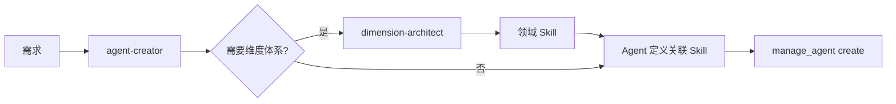

# Agent 创建指南（Agent Creator）

## 核心职责

将**用户需求或任务特征**转化为**可执行的 Agent 定义**，通过 `manage_agent` 工具持久化。

## 何时创建 Agent

### 用户主动请求

- "帮我创建一个代码审查助手"
- "我需要一个专门做翻译的 Agent"
- "做一个合同审查的专家"

### LLM 自主判断（更重要）

当你在处理任务时，如果发现：

- **重复性专业任务**：同类任务会反复出现（如批量审查、定期报告）
- **领域知识密集**：需要深度专业知识（如法律、医学、财务）
- **工具集合固定**：某类任务总是用同一组工具
- **指令模式固定**：每次都需要类似的行为约束

→ 你应该**主动提议或直接创建**一个专业 Agent。

## 创建流程（4 步）

```
需求/任务特征 → ① 意图分析 → ② 能力规划 → ③ 定义生成 → ④ 持久化
```

### Step 1：意图分析

从需求中提取关键信息：

| 要素      | 说明                  | 示例                       |
| --------- | --------------------- | -------------------------- |
| 核心任务  | 这个 Agent 主要做什么 | 审查代码质量               |
| 适用场景  | 什么时候需要它        | 代码提交前的质量把关       |
| 目标用户  | 谁会使用它            | 开发者、Tech Lead          |
| 输入/输出 | 接收什么、产出什么    | 输入代码文件，输出审查报告 |
| 领域      | 所属专业领域          | 软件工程                   |

**原则**：如有歧义，用 1-2 个引导式问题确认（提供选项，不空问）。

### Step 2：能力规划

基于意图分析，规划 Agent 的能力配置：

#### 2.1 工具选择

从可用工具中选择（只选需要的，不贪多）：

| 工具           | 用途         | 适合场景                     |
| -------------- | ------------ | ---------------------------- |
| `read`         | 读取文件     | 几乎所有 Agent 都需要        |
| `write`        | 写文件       | 需要输出报告/结果的 Agent    |
| `edit`         | 编辑文件     | 需要修改代码/文档的 Agent    |
| `exec`         | 执行命令     | 需要运行脚本/测试的 Agent    |
| `search`       | 搜索文件内容 | 需要查找代码/文本的 Agent    |
| `glob`         | 搜索文件名   | 需要发现文件的 Agent         |
| `memory`       | 记忆管理     | 需要记住经验/偏好的 Agent    |
| `manage_agent` | 管理 Agent   | 元 Agent（可创建其他 Agent） |

**原则**：

- 纯对话 Agent（翻译、问答）→ 可以不需要工具
- 分析型 Agent → `read` + `search` + `glob`
- 执行型 Agent → `read` + `write` + `edit` + `exec`
- 全能型 Agent → 不指定 tools（继承全部）

#### 2.2 Skill 关联

检查是否有现成的 Skill 可以增强 Agent：

- 先用 `skill_list` 工具查看可用 Skill
- 如果 Agent 需要维度化的评估能力 → 考虑先用 `dimension-architect` 创建领域 Skill
- 如果 Agent 的领域已有对应 Skill → 直接关联

#### 2.3 指令设计

系统指令（instructions）是 Agent 的灵魂。好的指令包含：

```
1. 角色定位  — 你是谁，擅长什么
2. 行为规范  — 如何工作，什么原则
3. 输出格式  — 结果长什么样
4. 约束边界  — 什么不做，什么要谨慎
```

**指令编写最佳实践**：

- 用中文编写（本系统的主要语言）
- 开头一句话定义角色："你是一个专业的{领域}{角色}..."
- 明确列出工作步骤（1、2、3...）
- 明确输出格式（Markdown 表格、清单、报告模板）
- 设定边界："如果遇到{情况}，你应该{动作}"

**指令编写反模式**：

- 太短太模糊："你是一个好助手"（无指导价值）
- 太长太啰嗦：超过 2000 字（LLM 注意力衰减）
- 与工具不匹配：指令说"运行测试"但没给 exec 工具
- 缺少输出格式：Agent 每次输出风格不一致

### Step 3：定义生成

将 Step 1-2 的分析结果组装为 `manage_agent` 工具的参数：

```json
{
  "action": "create",
  "agentId": "code-reviewer", // kebab-case
  "name": "代码审查专家", // 中文显示名
  "description": "审查代码质量...", // 一句话，用于匹配和展示
  "instructions": "你是一个专业的...", // Step 2.3 的产出
  "tools": ["read", "search", "glob"], // Step 2.1 的选择
  "skills": ["coding-standards"], // Step 2.2 的关联
  "createdBy": "agent" // 或 "user"
}
```

**ID 命名规范**：

- 使用 kebab-case（小写字母 + 连字符）
- 简短且有意义：`code-reviewer`、`contract-analyst`、`translator`
- 避免前缀/后缀冗余：不用 `agent-code-reviewer` 或 `code-reviewer-agent`

### Step 4：持久化

调用 `manage_agent` 工具执行 create 操作：

```
manage_agent(action="create", agentId="code-reviewer", name="...", ...)
```

创建成功后，告知用户：

- Agent 已创建
- Agent 的能力概述
- 如何使用（通过 agentId 指定，或由主 Agent 自动委托）

## 更新已有 Agent

如果用户反馈某个 Agent 表现不好，或需要调整能力：

1. `manage_agent(action="get", agentId="xxx")` 查看当前定义
2. 分析需要调整的部分
3. `manage_agent(action="update", agentId="xxx", instructions="新指令", ...)` 更新
4. 版本号自动递增

## 与 dimension-architect 协作

对于需要**结构化评估能力**的 Agent（如代码审查、合同审查、论文评审）：

1. 先调用 `dimension-architect`，为该领域创建维度 Skill
2. 维度 Skill 生成后，在 Agent 定义中关联该 Skill
3. Agent 的 instructions 中引用维度体系



但这**不是必须的**。简单的 Agent（翻译助手、日程管理）不需要维度体系。

## 多 Agent 委托与任务计划

当一个任务需要多个 Agent 协作时，**推荐使用 `task_plan` 工具来管理全过程**：

### 推荐工作流

1. **创建计划**：先分析任务，拆解为步骤，用 `task_plan(create)` 创建结构化计划
2. **逐步执行**：每个步骤用 `task_plan(update_step)` 标记状态，用 `delegate_to_agent(taskId=...)` 委托执行
3. **经验传递**：`delegate_to_agent` 会自动将前序子 Agent 的执行经验传递给后续子 Agent
4. **完成汇总**：所有步骤完成后，用 `task_plan(complete)` 标记并写入总结

### 子 Agent 工作空间

- 子 Agent 的工作空间嵌套在父 workspace 下：`tasks/{taskId}/agents/{agentId}/`
- 子 Agent 的执行结果自动写入：`tasks/{taskId}/results/{agentId}.md`
- 用户可以通过查看 `tasks/{taskId}/plan.md` 了解完整计划和进度

### 何时使用 task_plan

- **需要**：涉及 2 个以上子 Agent 的协作任务、需要跟踪进度的任务
- **不需要**：简单的单次委托、纯对话任务

详见 `references/shared-state-conventions.md`。

## 示例

### 示例 1：翻译助手（简单，无工具）

```json
{
  "action": "create",
  "agentId": "translator",
  "name": "翻译助手",
  "description": "中英双向翻译，保持原文风格和语气",
  "instructions": "你是一个专业的中英翻译助手。\n\n工作规范：\n1. 准确传达原文含义，不添加也不遗漏\n2. 保持原文的语气和风格\n3. 专业术语保留原文并在括号中给出翻译\n4. 如果原文有歧义，列出多种可能的翻译\n\n输出格式：\n- 直接给出翻译结果\n- 如有需要说明的地方，在翻译后用「译注」标注",
  "createdBy": "agent"
}
```

### 示例 2：代码审查专家（中等，有工具 + Skill）

```json
{
  "action": "create",
  "agentId": "code-reviewer",
  "name": "代码审查专家",
  "description": "审查代码质量、安全性和可维护性，输出结构化审查报告",
  "instructions": "你是一个资深的代码审查专家。\n\n审查维度：\n1. 正确性 — 逻辑是否正确，边界条件是否处理\n2. 安全性 — 是否有注入、泄漏、越权风险\n3. 可维护性 — 命名、结构、注释是否清晰\n4. 性能 — 是否有明显的性能问题\n5. 测试 — 是否有对应的测试覆盖\n\n工作流程：\n1. 先用 glob 找到相关文件\n2. 用 read 逐个阅读\n3. 用 search 查找潜在问题模式\n4. 输出结构化审查报告\n\n输出格式：\n| 文件 | 问题 | 严重级别 | 建议 |\n|------|------|----------|------|\n| ... | ... | 高/中/低 | ... |",
  "tools": ["read", "search", "glob", "write"],
  "createdBy": "agent"
}
```
